# VisualWeaver — Documentation

> A self-hosted AI chat application with Retrieval-Augmented Generation (RAG) powered by Redis vector search, supporting Ollama, Claude, OpenAI, Qwen, Mistral, Groq, and Gemini as LLM providers.

---

## Table of Contents

1. [Overview](#overview)
2. [Quick Start](#quick-start)
3. [Core Concepts](#core-concepts)
4. [Chat Interface](#chat-interface)
5. [RAG Instances](#rag-instances)
6. [LLM Providers](#llm-providers)
7. [Ingesting Content](#ingesting-content)
8. [Multi-RAG Parallel Queries](#multi-rag-parallel-queries)
9. [Semantic Cache](#semantic-cache)
10. [Multiple Redis Endpoints](#multiple-redis-endpoints)
11. [Settings Reference](#settings-reference)
12. [Keyboard Shortcuts](#keyboard-shortcuts)
13. [Keeping an answer](#keeping-an-answer)
14. [Analytics](#analytics)
15. [API Reference](#api-reference)
16. [Architecture](#architecture)
17. [Configuration File](#configuration-file)
18. [Backup and Restore](#backup-and-restore)
19. [Optional Dependencies](#optional-dependencies)
20. [Acknowledgments & License](#acknowledgments--license)

---

## Overview

VisualWeaver is a single-server, self-hosted application that lets you:

- Chat with Ollama, Claude, OpenAI, Qwen, Mistral, Groq, or Gemini
- Build named **RAG knowledge bases** from files, PDFs, web pages, and `llms.txt` manifests
- Store embeddings in **Redis** with HNSW vector indexing for fast semantic search
- Query **multiple RAG instances in parallel** across different Redis servers
- Cache repeated queries with a **semantic cache** that understands paraphrase similarity
- Render rich responses: Markdown and tables, syntax-highlighted code, LaTeX math (KaTeX), exact **function graphs** (math.js), **data charts** (Chart.js), **diagrams** (Mermaid, Graphviz), **geometric constructions** (JSXGraph), **maps** (Leaflet), **3-D plots** (Plotly), **molecules** (SmilesDrawer), **sheet music** (abcjs) and **inline SVG**
- Monitor retrieval quality per-instance with live analytics

<p align="center">
  
  
</p>

---

## Quick Start

### Prerequisites

- Python 3.11+ (macOS also needs Homebrew + Xcode Command Line Tools)
- Redis 8 with the search/query engine — set up automatically by `install.sh` (or the `redis:8` service in Docker); no separate install needed
- At least one LLM backend: Ollama locally, or an API key for any supported cloud provider

### Install and run

```bash
./install.sh     # Python venv + a self-contained Redis 8 in ./.redis
./start.sh       # starts Redis, then the app
# → Open http://localhost:8420
```

Or with containers — pull the prebuilt multi-arch app image (from GitHub's Container Registry) plus Redis, then start:

```bash
docker compose pull      # ghcr.io/sfcyris/visualweaver:latest + redis:8
docker compose up -d     # → http://localhost:8420
docker compose stop      # stop later (docker compose down to remove containers; data volume persists)
```

See the README for details.

On first launch a `config.json` is created (with defaults) in the per-platform data directory — `~/Library/Application Support/VisualWeaver` on macOS, `~/.local/share/visualweaver` on Linux — not in the repo. Configure Redis and your LLM provider via **Settings** before chatting.

### First run

Until a provider has a usable model, the welcome screen says so and offers the two places that fix it rather than suggestion prompts that cannot work. The message names the actual obstacle — Ollama running but with nothing pulled, or a hosted provider whose key is missing or was rejected.

<p align="center">
  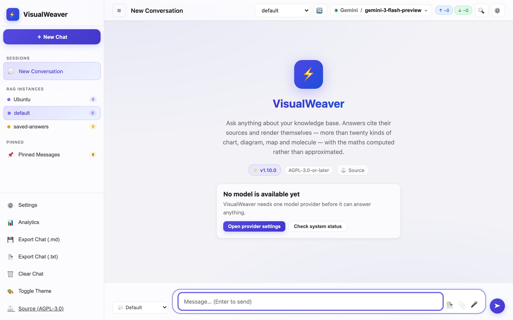
</p>

---

## Core Concepts

### RAG Instance

A named, isolated knowledge base. Each instance has its own Redis search index (`rag:{name}:idx`) containing vectorised text chunks. You can have as many instances as you like, each storing different domain knowledge (e.g. `product-docs`, `support-kb`, `internal-wiki`).

### Active RAG

The instance currently selected in the topbar dropdown. All queries are routed to this instance unless **parallel mode** (🔀) is enabled.

### Enabled / Disabled

Each instance can be toggled on or off without deleting it. Disabled instances are excluded from both single-instance and parallel queries.

| State | Single-instance mode | Parallel 🔀 mode |
|---|---|---|
| **Active** (selected in dropdown) | ✅ Searched | ✅ Searched |
| **Enabled** (not active) | ❌ Skipped | ✅ Searched |
| **Disabled** | ❌ Skipped | ❌ Skipped |

### Hybrid Search

Every RAG query runs two searches simultaneously and merges them using **Reciprocal Rank Fusion (RRF)**:

1. **Vector KNN** — semantic similarity via HNSW cosine distance. Finds paraphrases and related concepts.
2. **BM25 full-text** — keyword matching using Redis's built-in text index. Finds exact and near-exact terms even when their cosine score is borderline.

RRF formula: each result receives `1/(60 + rank)` for every list it appears in. Chunks ranking highly in both lists get the strongest boost.

Hybrid search is on by default and can be toggled in **Settings → RAG**.

### Semantic Cache

Before querying the LLM, every question is checked against a cache of previous (question, answer) pairs using cosine similarity. If a sufficiently similar question has been answered before, the cached response is returned instantly — no LLM call needed. RAG chunks from the original query are also stored in the cache and re-served with cache hits.

---

## Chat Interface

### Sending messages

Type in the input box at the bottom. Press **Enter** to send, **Shift+Enter** for a new line.

### Stopping a response

Click the red **■** stop button that appears during streaming to abort the current response. The partial text already generated is kept in the chat.

### Image attachments

Click the 📎 button or drag an image directly onto the input box. Images are sent to the model as multi-modal content. The vision badge (👁 Vision) appears in the topbar when the selected model supports images.

### Voice input

Click the 🎤 microphone button to toggle speech-to-text. Transcribed text is inserted into the input field.

### Token count

The top bar shows the token size of **the conversation you are currently viewing**, split into three colour-coded pills: **input** (↑, the full prompt each turn sent — system prompt, re-sent history and retrieved context included), **output** (↓, the model's replies) and **total** (Σ). These are the provider's own billed counts, stored with each answer. A leading `~` means at least one turn had no reported counts and was estimated instead (≈ characters ÷ 4) — cache hits and stopped answers never reach a provider, so they are always estimated.

The pills reset when you switch conversations. For the running total across **every** conversation, see the Token Usage card in [Analytics](#analytics).

### Prompt templates

Select a system-prompt template from the dropdown left of the input box to change how the model answers (e.g. "Redis Expert", "ELI5", or any custom template you've created).

### Message actions

Hover any AI message to reveal its action bar.

**Output** — 📋 **Copy** (plain text), 📝 **MD** (raw markdown to the clipboard), ⬇ **.md** (download), 📄 **PDF** (print/save), ⌥ **Raw** (toggle the rendered answer against the markdown behind it).

**Actions**

| Button | Action |
|---|---|
| 👍 / 👎 | Rate the answer — stored as feedback with the question, the model and the sources used |
| 📌 | Pin to the pinned panel for this browser session |
| ↻ | Regenerate; a version switcher appears so attempts can be compared |
| ⑂ | Fork the conversation here — a new session containing everything up to this answer |
| 💾 | [Keep this answer](#keeping-an-answer) — index it into a knowledge base so it outlives the cache and the conversation |

### Question actions

Hover any of **your** earlier questions to reveal its action bar:
- 📋 **Copy** — copies the question text to the clipboard
- ↻ **Rerun** — asks it again (a close-enough answer may be served from the semantic cache)
- ↺ **Force rerun** — asks it again while bypassing the cache, for a fresh answer from the model

### Cached message actions

Messages served from the semantic cache have two additional buttons:
- **🗑 Uncache** — Deletes this specific cache entry from Redis. Future identical queries will go to the LLM instead.
- **↺ Re-run fresh** — Re-sends the original query to the LLM, bypassing the cache. The new response automatically replaces the cached one.

### Rich content rendering

Answers are rendered inline: the model writes a short, declarative block and the browser draws it. The full set of supported types:

| Fence | Renders | You write | Engine |
|---|---|---|---|
| *(none)* | Markdown | Full GFM: headings, bold, tables, blockquotes, lists | marked |
| ` ```<language> ` | Code | Ordinary code | highlight.js |
| ` ```latex ` / ` ```math ` / `$…$` | Math formula | LaTeX | KaTeX |
| ` ```plot ` | **Function graph** (exact); optional live parameter sliders | `y = a*sin(b*x)`, `x = -5 .. 5`, `param: a = 0.5 .. 3 (1)` | math.js |
| ` ```chart ` | **Data chart** — bar, line, pie, doughnut, scatter, radar | Chart.js JSON | Chart.js |
| ` ```mermaid ` | **Diagram** — flowchart, sequence, class, state, ER, Gantt | mermaid syntax | Mermaid |
| ` ```dot ` | **Auto-laid-out graph** — dependency/call graphs | Graphviz DOT | Viz.js |
| ` ```geometry ` | **Geometric construction** | JSON: `boundingbox` + `elements` | JSXGraph |
| ` ```fractal ` | **Fractal** — Mandelbrot/Julia (click-to-zoom), IFS chaos game, L-system curves, strange attractors; 21 presets ([full list](#fractals-and-attractors)) | JSON: `type` + parameters | plain canvas (no library) |
| ` ```map ` | **Map** with markers / GeoJSON | JSON: `center`, `zoom`, `markers` | Leaflet + OpenStreetMap |
| ` ```plot3d ` | **3-D surface / scatter** | Plotly JSON | Plotly |
| ` ```molecule ` | **Chemical structure** | a SMILES string | SmilesDrawer |
| ` ```molecule3d ` | **3D structure**, rotatable/zoomable | XYZ format: atom count, comment line, then `Element x y z` per atom | 3Dmol.js |
| ` ```gantt ` | **Project schedule** — dates, durations, dependencies | mermaid gantt syntax (no leading `gantt` line) | mermaid |
| ` ```timeline ` | **Dated event sequence** | mermaid timeline syntax (no leading `timeline` line). Times of day are written as normal — `2024-01-01 00:00 : Sunrise` — in periods, section labels and accessibility lines alike | mermaid |
| ` ```network ` | **Force-directed graph**, draggable nodes | JSON `{"nodes":[…],"edges":[{"from":…,"to":…}]}` | vis-network |
| ` ```geojson ` | **Geographic features** with click popups | a GeoJSON FeatureCollection (coordinates are `[lng,lat]`) | Leaflet |
| ` ```abc ` | **Sheet music**, with a Play button | ABC notation | abcjs |
| ` ```calc ` | **Computed arithmetic** — units, dates, matrices | one expression per line, e.g. `5 km/h to m/s` | math.js |
| ` ```solve ` | **Symbolic algebra** — derivative, simplify, expand, roots, evaluate | `derivative: x^3 + 2x` | math.js |
| ` ```stats ` | **Descriptive statistics** + linear regression | `data: 4, 8, 15` (or `x:` / `y:` lines) | math.js |
| ` ```table ` | **Sortable / filterable table**, computed totals, CSV export | JSON: `columns`, `rows`, optional `total` | native |
| ` ```diff ` | **Line diff** (LCS) of two texts | `--- before` / lines / `--- after` / lines | native |
| ` ```regex ` | **Runs a pattern** against samples, highlights matches + groups | `pattern:` / `flags:` / `test:` lines | native |
| ` ```truth ` | **Truth table** for a boolean expression (≤10 vars) | `(A and B) or not C` | math.js |
| ` ```svg ` (or `xml` / raw `<svg>`) | Custom vector graphic | SVG markup (sanitised) | native |

Notes:

- Every rendered *figure* (chart, diagram, plot, map, molecule, score, SVG, LaTeX) carries a **Source** toggle and **Copy** button, so the underlying markup is always inspectable; SVG additionally offers **⬇ PNG**. Ordinary Markdown and code blocks are not figures — code blocks get a plain **Copy** button.
- A raw `<svg>…</svg>` with no code fence is detected and rendered too.
- **Computed, not asserted:** `calc`, `solve`, `stats`, `truth`, `table`, `diff` and `regex` are evaluated in your browser, not produced by the model. The model states *what* to compute (an expression, a data list, two texts); the browser returns the exact result — so unit conversions, column totals, derivatives and truth tables don't inherit the model's arithmetic mistakes. `calc`/`solve`/`stats`/`truth` use math.js (already loaded); `table`/`diff`/`regex` use no library at all.
- **Interactive `plot`:** declare a parameter with `param: a = <lo> .. <hi> (<init>)` and the block renders a slider; dragging it re-evaluates the formula and redraws instantly, with no round trip to the model.
- **Lazy loading:** the heavier renderers — Chart.js, Mermaid, Viz.js, JSXGraph, Leaflet, Plotly, SmilesDrawer, 3Dmol.js and highlight.js — are fetched only the first time a block of that type appears, so they cost nothing at page load. Markdown, sanitising, math and music (marked, DOMPurify, KaTeX, math.js, abcjs) load with the page because they are needed for ordinary answers.
- **Maximize and save as image:** every visual card (chart, diagram, plot, map, geometry, molecule, 3D molecule) has an ⛶ **Maximize** button that opens it full-viewport, and most also have a ⬇ **PNG** button. Not offered on `map` (no rasteriser wired up) or the plain-data lanes (`table`, `diff`, `regex`, `calc`, `solve`, `stats`, `truth`) — those aren't rasterised images.
- **Third-party requests:** all renderer libraries are served from a public CDN (cdnjs, plus jsDelivr for SmilesDrawer), so rendering is not fully offline. In addition, ` ```map ` fetches map tiles from `tile.openstreetmap.org` at view time — the only lane that sends *content-derived* data (the requested coordinates) to a third party. For an air-gapped deployment, vendor the libraries and serve them locally.
- **Safety:** SVG and diagram output is sanitised (DOMPurify) before insertion, and ` ```geometry ` accepts data only — never function or code strings.

### Rendering examples

| | |
|---|---|
|  |  |
| 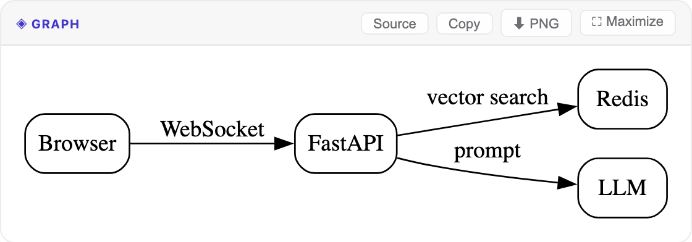 |  |
|  |  |
|  |  |

| | |
|---|---|
| 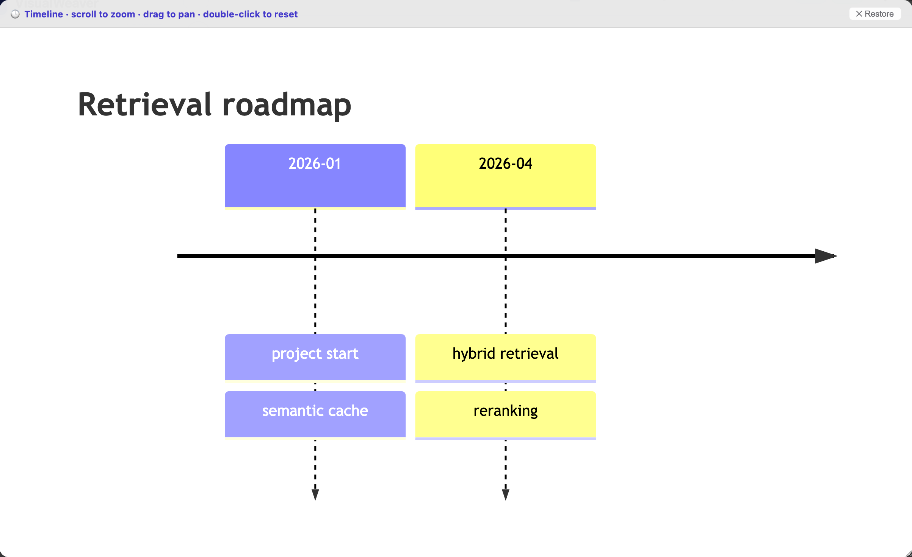 | 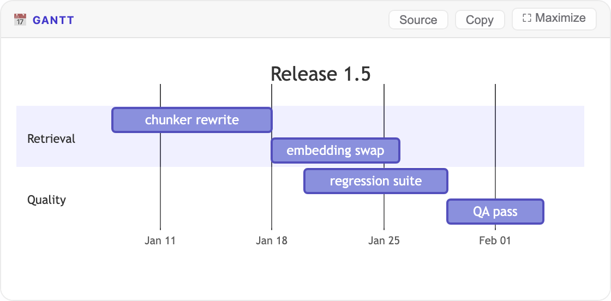 |
| 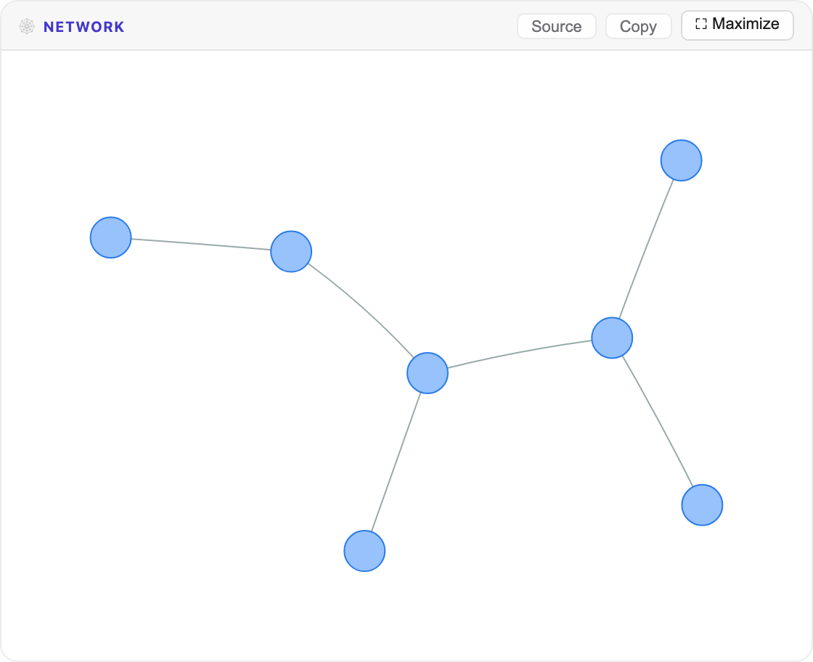 | 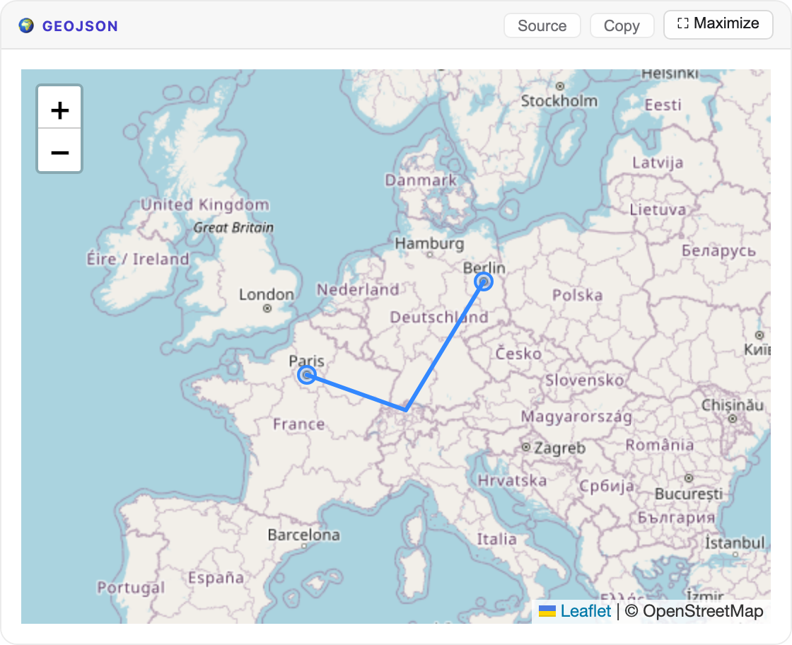 |
| 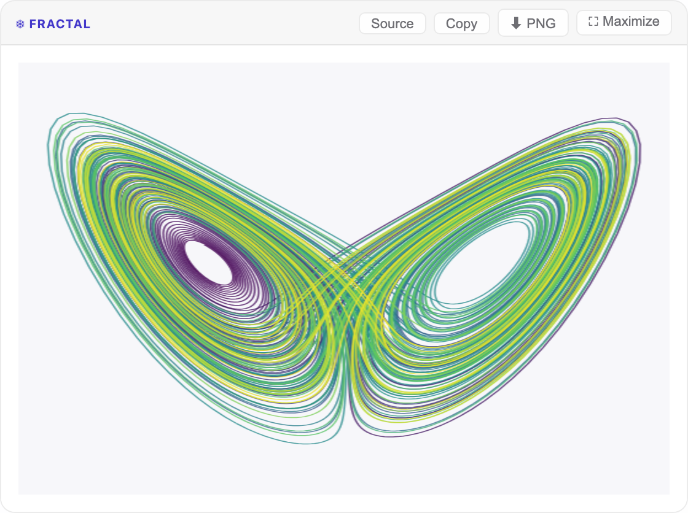 | 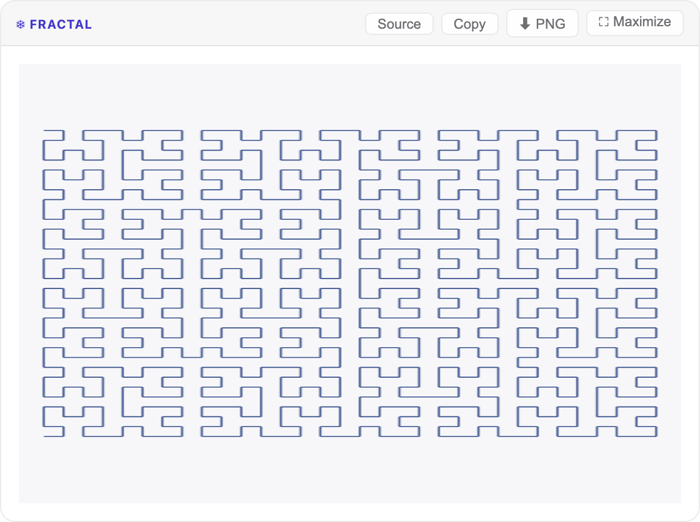 |

### Fractals and attractors

The ` ```fractal ` lane computes the iteration in the browser on a plain canvas.
Naming a preset is all a question needs:

| Group | Presets |
|---|---|
| Escape-time | `mandelbrot`, `julia` — click to zoom in, shift-click to zoom out |
| Chaos game (IFS) | `fern`, `sierpinski`, `carpet` |
| Curves (L-system) | `koch`, `dragon`, `levy`, `arrowhead`, `gosper`, `plant`, `tree` |
| Space-filling curves | `hilbert`, `peano`, `moore` |
| Strange attractors | `lorenz`, `rossler`, `thomas`, `halvorsen`, `clifford`, `dejong` |

Common spellings reach the same preset — `Hilbert Curve`, `flowsnake`,
`Koch snowflake` and `lorenz_attractor` all resolve.

Every option is optional:

- `palette` — `viridis` (default), `fire`, `ocean` or `mono`.
- `order` — recursion depth of a curve, from 1 up to a per-curve maximum:
  `peano` 4, `gosper` 5, `moore` 6, `hilbert`, `koch` and `plant` 7, `arrowhead` 10,
  `tree` 13, `dragon` and `levy` 14. Above its maximum a curve reports
  `L-system exceeds 120000 symbols` instead of drawing.
- `iter` — escape-time detail (16–1000), or the number of points along an
  attractor's orbit.
- `plane` — `xy`, `xz` or `yz`: which projection to draw of `lorenz`, `rossler`,
  `thomas` or `halvorsen`. `clifford` and `dejong` are already flat and ignore it.
- An attractor's own coefficients: `sigma` / `rho` / `beta` for `lorenz`, `a`–`c`
  for `rossler`, `a`–`d` for `clifford` and `dejong`, `b` for `thomas`, `a` for
  `halvorsen`. `dt` sets the integration step of the four continuous systems.
- `c` — for `julia` only, the complex constant as `[re, im]`.
- `center`, `zoom` — for `mandelbrot` and `julia`. `points` — for `ifs`.
  `axiom`, `rules`, `angle`, `depth` — for a hand-written `lsystem`.

So `{"type":"hilbert","order":5}` draws a fifth-order Hilbert curve,
`{"type":"lorenz"}` draws the Lorenz butterfly, and
`{"type":"lorenz","plane":"xy","palette":"fire"}` draws it from above.

Anything the presets do not cover is written out in full as
`{"type":"ifs","maps":[…]}` or
`{"type":"lsystem","axiom":…,"rules":…,"angle":…,"depth":…}`. An L-system's rule
strings use letters and `+ - [ ]` only: `F` and `G` draw a step, `f` moves without
drawing, `+` and `-` turn, `[` and `]` open and close a branch.

### Working with tables and charts

Every Markdown table an answer produces gets a toolbar: click any header to sort
(numbers, currency and dates sort by value, not alphabetically), filter rows as
you type, and copy or download the visible rows as CSV. The header stays put
while the body scrolls.

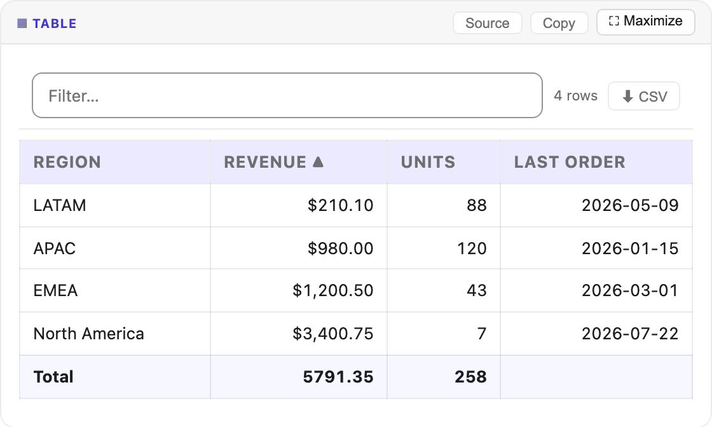

Line, scatter and bubble charts support wheel-zoom (hold Ctrl) and drag-to-pan,
with a **Reset zoom** button once you have moved. Every chart also has a **Data**
button that reveals the series behind it as one of those sortable tables — so you
can check the numbers a chart was drawn from.

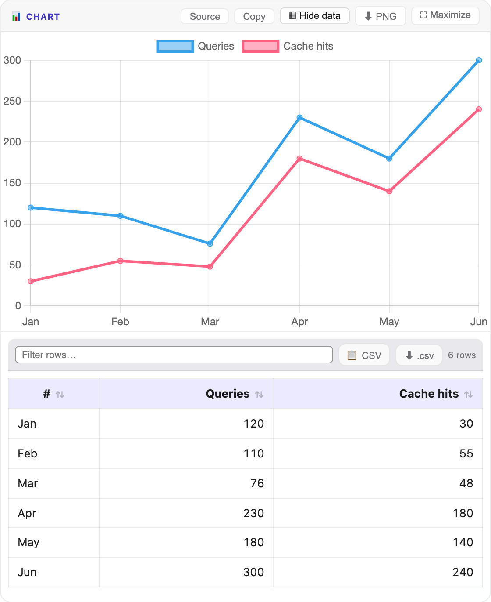


### RAG context inspector

After each AI response that used RAG, a **📚 N matched chunks** badge appears in the message metadata row.

- By default the inspector is **collapsed** — click the badge to expand it
- To open it automatically after every answer, enable **Show RAG Matches in Answers** in **Settings → General**
- Cache hits also show their associated RAG chunks (stored at cache-write time)

### Citations

When an answer is grounded in your knowledge base, the retrieved passages are numbered and the model marks each claim with the passage it came from — `[1]`, `[2]`, and so on.

**Each marker is a button.** Click one to open the RAG inspector, expand that source and highlight it. A bracketed number inside a code sample is left alone — `arr[1]` is an array index, not a reference.

`[2]` and **#2** always refer to the same passage, in a live answer, a reopened conversation and a cached one alike. The inspector lists passages best-match-first, which is not necessarily the order they were numbered in.

<p align="center">
  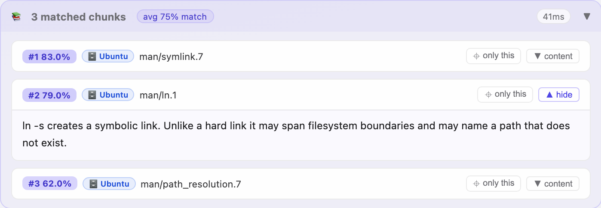
</p>

<p align="center">
  
</p>

### Scoping a question to one document

Click **⌖ only this** on any chunk in the inspector — or the ⌖ button in the document list — to restrict the *next* question to that source. A chip appears above the composer showing the active scope; click ✕ to clear it. The filter is applied inside the search itself (both the vector and keyword halves), not by discarding results afterwards, so scoped questions still return the best matches *within* that document.

### When nothing matches

If retrieval runs and finds nothing above the similarity threshold, the answer is marked **📭 No KB match** and the model states plainly that it is answering from general knowledge rather than your documents. Click the badge to open the RAG threshold setting.

<p align="center">
  
</p>

An answer with no badge at all was produced without RAG (all instances disabled, or none selected).

### Finding an earlier answer

**Shift+⌘/Ctrl+F** opens VisualWeaver's own search. Plain ⌘/Ctrl+F is left to the browser, whose find covers the rendered page.

- Searches message text **and the retrieved source passages** stored with each answer
- **All conversations** widens it beyond the current one; conversations stored only on the server are loaded on demand, and any that cannot be loaded are named
- Reports the match count, highlights each hit in context, and names the conversation a result came from
- Clicking a result opens that conversation at the message

<p align="center">
  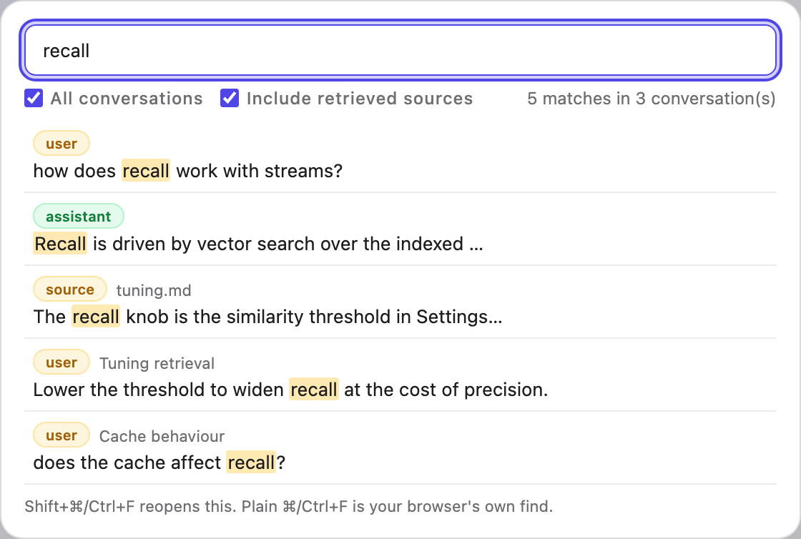
</p>

### Notifications

Messages appear bottom-right. **Errors stay until dismissed**; everything else clears itself after a few seconds. Hovering pauses the countdown, and ✕ dismisses immediately.

- A message repeated while it is still on screen collapses into one entry with a count
- At most five are shown at once; the full history is kept regardless
- **Settings → Logs → Notifications** lists every message raised this session, newest first, with an error count. It is cleared on reload

<p align="center">
  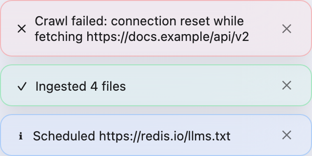
</p>

<p align="center">
  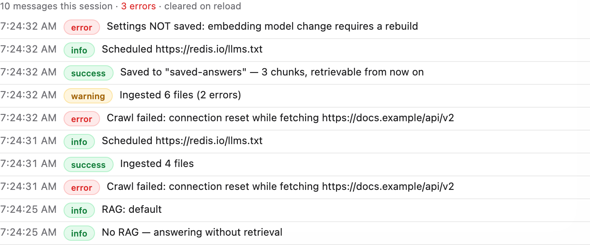
</p>

### Session management

Sessions are listed in the left sidebar. Click any session to switch to it, or the ✕ to delete it (with confirmation).

The foot of the sidebar holds the actions that apply to the conversation you are in — **Export Chat** as `.md` or `.txt`, and **🗑 Clear Chat**, which empties the current conversation after a confirmation and leaves every other one alone.

Conversations are **persisted in Redis and restored on reload** — closing the tab or restarting the browser no longer loses them, and the conversation you were last in is reopened automatically. The sidebar lists conversations started in *this* browser; because VisualWeaver has no user accounts, it deliberately does not list sessions created elsewhere.

Each message records the provider and model that produced it. Sessions are automatically titled from the first message.

### Regenerating an answer

**↻ Regenerate** re-asks the question that *that* answer belongs to and replaces it **in place**, rather than appending a second copy of the question. Earlier attempts are kept: a **‹ 1/2 ›** control appears in the message metadata row so versions can be compared. Regenerating an answer that has later turns after it will discard those turns, and asks for confirmation first.

---

## RAG Instances

### Creating an instance

1. Open **Settings → RAG**
2. Click **＋ New Instance**
3. Enter a name (letters, numbers, hyphens), pick a colour, and optionally select a Redis endpoint
4. Click **Create**

### Instance controls

Each card in the instance list exposes:

| Button | Action |
|---|---|
| **● On / ○ Off** | Enable or disable the instance |
| **📄 Documents** | Browse the documents in the instance; scope a question to one, or delete one |
| **⬇** | Export the instance to a `.zip` file (includes all chunks and embeddings) |
| **⬆** | Import from a previously exported `.zip` |
| **✦ Dedupe** | Deduplicate — remove exact-duplicate chunks to reduce storage footprint |
| **🧹** | Clear all chunks (wipes data, keeps the instance) |
| **🗑** | Permanently delete the instance |

### Managing individual documents

**📄 Documents** lists every source in the instance with its chunk count and ingest date.

<p align="center">
  
</p>

- **⌖** scopes the next question to that document (see *Scoping a question to one document*)
- **🗑** removes just that document's chunks, leaving the rest of the instance untouched

Deleting a document also releases its de-duplication fingerprints, so the same file or URL can be re-ingested afterwards — which is the supported way to refresh a single stale document without wiping and rebuilding the whole instance.

The date column shows `—` for documents ingested before this metadata was recorded; they are otherwise fully functional and gain a date when re-ingested.

### Exporting and importing

Exports produce a ZIP containing `meta.json` and `chunks.json`. Embeddings are included as base64, so re-embedding is not needed on import — making it fast.

When importing into an existing instance, the current endpoint assignment and colour are preserved; only the chunk data is replaced.

### Deduplication (Chunk Optimization)

Click **✦ Dedupe** on any instance card to remove exact-duplicate chunks. Two chunks are considered duplicates if their text is identical after lowercasing and whitespace normalisation.

---

## LLM Providers

All providers are configured in **Settings → Providers** — a unified accordion UI where each provider is a collapsible card. Click any card header to expand it; the currently active provider is highlighted.

### Provider overview

| Provider | Type | Notes |
|---|---|---|
| ⚡ Ollama | Local | Any model installed locally; vision auto-detected |
| ✦ Claude | API | Anthropic native SDK; `claude-opus-4-6`, `claude-sonnet-4-6`, etc. |
| ◆ OpenAI | API | OpenAI native SDK; GPT-4o, GPT-4.1, o-series |
| 🟣 Qwen | API | Alibaba DashScope (OpenAI-compatible), `qwen-max`, `qwen-plus`, etc. |
| ⚡ Groq | API | Ultra-fast inference (OpenAI-compatible), Llama / Mixtral / Gemma |
| ◐ Mistral | API | EU-hosted (OpenAI-compatible), free "Experiment" tier; `mistral-large-latest`, `mistral-small-latest` |
| ✦ Gemini | API | Google AI native SDK; chat-capable `gemini-*` models, listed live from your key |

### Choosing a provider and model

The top bar carries one model picker, reading `● Ollama / gemma4:31b-mlx`. Opening it
lists every model grouped by provider, with a status dot on each group — green when the
provider is reachable, red when it is configured but failing. Type to filter across all
of them. Choosing a model switches the provider with it, so the pair is always
consistent.

Providers with no API key are collapsed into a single row at the bottom that links
straight to **Settings → Providers**; they stay listed rather than being hidden, so a
provider you have not set up is still visible as something you could use.

Each provider's **default** model is marked with its own colour and a `default` badge.
That is the model you get on switching to a provider you have not chosen one for — on
Gemini and Mistral it is the free-tier model.

A provider offering more than eight models shows the first few behind a **Show all N**
row. The order is: the model in use, then the provider's default, then `-latest`
aliases, then stable names, with pinned dated snapshots last. The model in use and the
default are always shown.

Models are filtered to those that can hold a conversation. Where a provider reports
per-model capabilities, that report is used: Gemini models without `generateContent`
and Mistral models without `completion_chat` are not offered, which excludes embedding,
OCR, moderation, text-to-speech, image, robotics and live-audio models from the list.

The 👁 marker on a model means it accepts image attachments, which enables the 📎
button in the composer.

The **Use** button inside a provider card in **Settings → Providers** still switches
provider too.

### Environment variables

API keys can be supplied via environment variables — they are never written to `config.json`:

```bash
export ANTHROPIC_API_KEY="sk-ant-..."
export OPENAI_API_KEY="sk-..."
export DASHSCOPE_API_KEY="sk-..."
export MISTRAL_API_KEY="..."
export GROQ_API_KEY="gsk_..."
export GEMINI_API_KEY="AIza..."
```

### OpenAI-compatible endpoints

Any provider using the OpenAI-compatible API (OpenAI, Qwen, Groq, and many others) can be pointed at a custom base URL.

| Provider | Default base URL |
|---|---|
| OpenAI | `https://api.openai.com` |
| Qwen (DashScope) | `https://dashscope.aliyuncs.com/compatible-mode/v1` |
| Mistral | `https://api.mistral.ai/v1` |
| Groq | `https://api.groq.com/openai` |
| LM Studio | `http://localhost:1234` |
| Together AI | `https://api.together.xyz` |

### Native SDK usage

Each provider uses its official Python SDK for streaming:

| Provider | SDK | Streaming method |
|---|---|---|
| Claude | `anthropic` | `AsyncAnthropic.messages.stream()` |
| OpenAI | `openai` | `AsyncOpenAI.chat.completions.create(stream=True)` |
| Qwen | `openai` (DashScope) | Same as OpenAI with custom `base_url` |
| Mistral | `openai` (Mistral endpoint) | Same as OpenAI with custom `base_url` |
| Groq | `openai` (Groq endpoint) | Same as OpenAI with custom `base_url` |
| Gemini | `google-genai` | `client.aio.models.generate_content_stream()` |

---

## Ingesting Content

### From files — with live progress

1. **Settings → RAG → Ingest Documents**
2. Select a target RAG instance
3. Drop files onto the upload area or click to browse
4. Supported formats: `.txt`, `.md`, `.csv`, `.pdf` (needs PyMuPDF), `.docx` (needs python-docx), `.xlsx` (needs openpyxl)

Files are processed one by one via a streaming SSE connection. The progress bar advances per-file and shows the file name and chunk count in real time.

- **✕ Cancel** stops before the next file. Everything already indexed is kept — this is a stop, not a rollback — and uploads that were never reached are removed
- Reopening **Settings → RAG** re-attaches to an ingest still running on the server and keeps following it. If several are running, the others are offered
- On a first run the panel reports that the embedding model is downloading (about 90 MB) before indexing starts
- A file the indexer reports as failed — an unsupported type, a scanned PDF with no extractable text — counts towards errors, not successes

<p align="center">
  
</p>

### From a URL

1. **Settings → Web Sources**
2. Enter a URL and configure:

| Setting | Description |
|---|---|
| **Depth** | 0 = page only; 1–3 = follow links N levels deep |
| **Max Pages** | 0 = unlimited; set a cap to avoid runaway crawls |
| **Respect robots.txt** | Honour crawl restrictions |
| **Local links only** | Stay within the same domain |

3. Click **🕷 Start Crawl** — progress streams in real time

### llms.txt manifests

URLs ending in `llms.txt` (e.g. `https://redis.io/llms.txt`) are treated as curated link manifests. All linked pages are fetched regardless of domain. This is the fastest way to ingest entire documentation sites.

**Presets** for common sources:
- 🟥 Redis Docs (llms.txt)
- 🐍 Python Docs
- 🦜 LangChain

### Chunking — sentence-aware

Text is split into overlapping chunks that **respect sentence boundaries**. The chunker splits on `.`, `!`, and `?` first, then groups sentences into windows of approximately `chunk_size` words.

Content with no sentence punctuation — CSV and spreadsheet rows, Markdown tables, code — is split on line boundaries instead, so a large table cannot become one enormous chunk. A chunk is never allowed to exceed twice `chunk_size`.

Configure in **Settings → RAG**:

| Setting | Default | Description |
|---|---|---|
| **Chunk Size** | 180 words | Target words per chunk |
| **Chunk Overlap** | 32 words | Words of context carried into the next chunk |

> **Chunk size is bounded by the embedding model.** Each model can only encode a fixed number of tokens (`intfloat/multilingual-e5-small` handles 256, roughly 190 English words) and silently truncates anything longer — the excess text is still stored and shown, but is **not represented in the vector**, so it cannot be found by semantic search. VisualWeaver warns in the log when the configured chunk size exceeds what the active model can encode, and lowers a saved value that is already over the limit (logging the change).

---

## Multi-RAG Parallel Queries

Click the **🔀** button in the topbar (next to the RAG dropdown) to enter parallel mode.

In parallel mode:
- **All enabled** RAG instances are queried simultaneously
- Each instance can live on a **different Redis server** — queries fan out concurrently
- Results from all instances are merged and re-ranked by score
- The top-K chunks (across all knowledge bases) are injected into the LLM context
- Each chunk in the RAG inspector shows which instance it came from (🗄 instance-name)

To return to single-instance mode, click 🔀 again or select a specific instance from the dropdown.

### No retrieval (No RAG)

Select **⊘ No RAG** from the top-bar dropdown to answer the next messages with **no** retrieval at all — the model replies from its own knowledge, with no knowledge-base search and no grounding or citation instructions. This is distinct from querying a single instance or **✦ All RAGs** in parallel; pick a specific instance (or All RAGs) again to resume retrieval.

---

## Semantic Cache

The cache intercepts queries before they reach the LLM. If a semantically equivalent question exists in the cache (above the similarity threshold), the stored answer — including associated RAG chunks — is returned immediately.

| Setting | Default | Effect |
|---|---|---|
| **Enabled** | ✅ | Toggle the cache on/off |
| **Similarity Threshold** | set by the embedding model | Higher = stricter match required for a cache hit |
| **TTL** | 3600 s | Seconds before a cached entry expires |

### The similarity threshold is set by the embedding model

Left unset, the threshold follows whichever embedding model is configured:

| Embedding model | Threshold |
|---|---|
| `all-MiniLM-L6-v2` | 0.93 |
| `multilingual-e5-small` | 0.98 |
| `multilingual-e5-base` | 0.98 |
| `bge-m3` | 0.93 |
| anything else | 0.98 |

These are not interchangeable. The models place unrelated text at very different
similarities — two questions about completely different subjects score about 0.10 apart
under `all-MiniLM-L6-v2` and about 0.80 apart under `multilingual-e5-base` — so the same
number is a permissive setting under one model and admits unrelated questions under
another. Changing the embedding model therefore resets the threshold along with the
cached entries, which are also not comparable across models.

Each value is the lowest that admitted no unrelated question in the set at
`tests/fixtures/cache_calibration.py`, on the basis that the two mistakes do not cost the
same: a wrong hit answers a question that was never asked, while a miss costs one model
call. You can still set the value yourself, and an explicit setting is kept until the
embedding model changes.

**What this cannot do.** Two questions that differ in one decisive word — *enable* against
*disable*, *Q1* against *Q2*, *back up* against *restore* — score higher than most genuine
rewordings, in every model tested. No threshold separates them, so the values above are
chosen to exclude them and give up cache hits to do it. Raising the hit rate by lowering
the threshold trades directly against answering the wrong question.

The cost of that is not evenly spread. Under `multilingual-e5-base`, unrelated questions
already sit near 0.80, so the safe value is 0.98 and only near-identical wording matches —
the cache behaves close to an exact-match cache. Under `all-MiniLM-L6-v2` and `bge-m3`,
which spread their scores much further apart, the safe value is 0.93 and genuine rewordings
match. If cache hit rate matters to you more than multilingual retrieval, that is the
trade-off to weigh.

### Requests to draw something

A question that asks to *see* something — a chart, a diagram, a plot — is cached, but is
matched only when the question is the same question, not a similar one. Similarity does not
work there: a drawing request is mostly scaffolding around one word that carries the whole
meaning, so *"chart of CO2 emissions 1990-2020"* and *"…2000-2020"* score 0.9867 apart, and
*"plot f(x) = sin(x)"* and *"sin(2x)"* score 0.9790 — both above any threshold that would
still match anything. Asking the identical question again is served from the cache;
anything else generates fresh.

Cache hits appear with a green **⚡ Cached XX%** badge showing the match score.

Answers that were not served from the cache say which: **🔍 Live** when nothing similar was
stored, **🚫 Not cached** for a request that is never cached (an attachment, or a chart or
diagram, which is always generated fresh), and **↻ Regenerated** when the cache was
deliberately bypassed.

### Managing individual cache entries

Every cached message has two action buttons:

- **🗑 Uncache** — Removes just that one cache entry from Redis. Future queries that would have matched it will go to the LLM instead.
- **↺ Re-run fresh** — Bypasses the cache for this query only, re-generates a fresh response, and the new answer automatically updates the cache.

Clear the entire cache in **Settings → Cache → 🗑 Clear Cache**.

> **Note:** The semantic cache requires Redis Stack (RediSearch module). If your Redis instance does not have the Search module, the cache is silently disabled and a single warning is logged on startup.

---

## Multiple Redis Endpoints

Each RAG instance can be stored on a different Redis server. This allows horizontal scaling across Redis Enterprise databases.

### Adding an endpoint

1. **Settings → Redis → Additional Redis Endpoints**
2. Click **＋ Add Endpoint**
3. Fill in name, host, port, password, database index, and SSL toggle
4. Click **Add**

### Assigning an instance to an endpoint

When creating a new RAG instance, the **Redis Endpoint** dropdown lists all configured endpoints.

### How routing works

- `rc_for_instance(name)` searches **all configured endpoints** for the instance's metadata key (`rag_meta:{name}`)
- Queries, ingestion, exports, and deduplication are automatically routed to the correct server
- Parallel 🔀 mode fans out to multiple servers concurrently using `asyncio.gather`

---

## Settings Reference

Settings are organised into tabbed groups. See [SETTINGS.md](SETTINGS.md) for a detailed explanation of every individual field and its implications.

### Group 1 — Infrastructure

#### 💡 Status
Live health check for all connected services. Shows Redis version, Ollama availability, and API key validity. Local checks (Redis, Ollama) run every 30 seconds; cloud provider key checks run every 5 minutes.

#### 🗄 Redis
Configure the primary Redis connection (host, port, db, password, SSL). Manage additional named endpoints. Memory usage monitor.

### Group 2 — Knowledge

#### 📚 RAG
- **Chunk Size** and **Chunk Overlap** (sentence-aware chunking)
- **Top-K** — number of chunks returned per query
- **Similarity Threshold** — minimum cosine score for a chunk to be sent to the LLM
- **⚡ Hybrid Search** — combines vector KNN with BM25 full-text search (recommended: on)
- RAG instance management: create, delete, toggle, export, import, deduplicate
- File ingestion panel with live per-file streaming progress

#### 🌐 Web Sources
URL crawler with depth and page-cap controls. Real-time progress log. Saved web source list.

#### ⚡ Cache
Enable/disable semantic cache, threshold, TTL, analytics, and clear button.

### Group 3 — Providers

#### 🤖 Providers
All seven providers in a single accordion tab. Each provider has a collapsible card showing its configuration fields, connection test button, and a **Use** button to set it as the active provider.

The card header shows:
- A status dot (green = connected, red = error, grey = not configured)
- Provider name and category tag (Local / Free / API)
- Currently selected model name
- Expand/collapse chevron

### Group 4 — App Config

#### 🔧 General
- **Theme** — light / dark / auto
- **Embedding Model** — select and re-index if changed
- **Max Image Dimension** — for vision model attachments
- **📚 Show RAG Matches in Answers** — auto-expand RAG inspector
- Config import/export/reset

#### 💬 Templates
Create, edit, and delete named system prompts.

#### 🔐 Security
VisualWeaver has **no built-in authentication**. The password field here is stored but **not currently enforced** — access is not gated on it. The app binds to `127.0.0.1` by default; put a reverse proxy with HTTPS + auth in front before exposing it to a network (see `deploy/docker-compose.https.yml`).

### Group 5 — Diagnostics

#### 📊 Analytics
Session-level cache hit/miss rates, latency histogram, message statistics, and per-instance RAG performance table.

#### 📋 Logs
Every message raised this session (see [Notifications](#notifications)), then the last 200 ingestion events — filterable by status, instance, or source URL.

### Unsaved changes

The panel mixes two kinds of control, and says which is which:

- **Staged until you press Save Settings** — API keys, model choices, RAG and cache tuning, prompt templates, crawl defaults, and the selected provider
- **Applied as you change them** — RAG instances and Redis endpoints. The sections that behave this way say so in place

Editing a staged control marks the panel **Unsaved changes**, and closing it then — with Cancel, Escape or a click outside — asks before discarding. Switching provider counts as an edit: it takes effect in the browser straight away but is only remembered once you save.

<p align="center">
  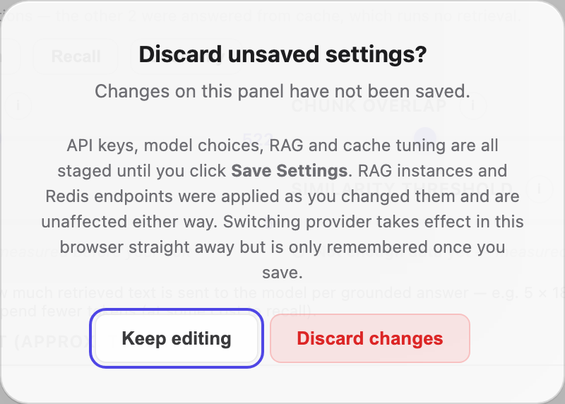
</p>

---

## Keyboard Shortcuts

| Shortcut | Action |
|---|---|
| `Enter` | Send message |
| `Shift+Enter` | New line in input |
| `⌘/Ctrl+Enter` | Send message |
| `⌘/Ctrl+K` | Open Settings |
| `⌘/Ctrl+Shift+F` | Search conversations |
| `⌘/Ctrl+F` | Your browser's own find — VisualWeaver does not intercept it |
| `Esc` | Close panel |

---

## Keeping an answer

Answers are otherwise transient: the semantic cache expires on `cache.ttl` (one hour by
default), the conversation expires on `sessions.ttl` (one day), and **📌 Pin** lasts only
until the page is reloaded.

**💾** on any answer opens a review dialog and then indexes the answer into a RAG instance,
where it has no expiry and is retrievable in later answers.

- **What is stored.** The question and the answer together (the question carries the
  wording a later search will match on), plus the sources the answer cited, as a markdown
  list. Everything is editable before saving.
- **Where.** A dedicated `saved-answers` instance, created on first use; pick a different
  one in the dialog. A saved answer is retrieved and cited *exactly* like a source document,
  and being phrased in the language of the question it can rank above the document it came
  from — keeping it in its own instance means it can be switched off from the top-bar
  selector when an answer must be grounded only in real sources.
- **Undoing it.** Each saved answer is one document named
  `answer://<date> <title>`, listed under **Settings → RAG → Documents** and deletable on
  its own.
- **Re-saving.** Chunks are deduplicated per source, so saving an unchanged answer under
  the same title again stores nothing and says so.

<p align="center">
  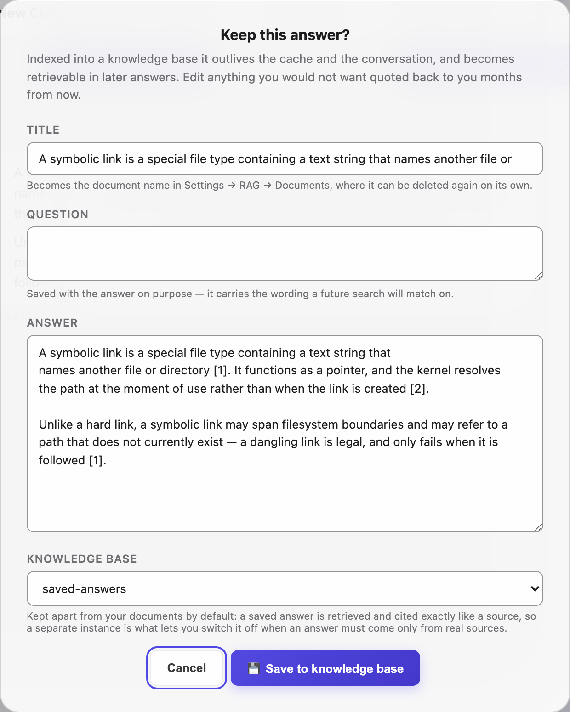
</p>

---

## Analytics

Open **Settings → Analytics** for live performance statistics.

### Session-level metrics

- **Total Queries** — messages sent this session
- **Cache Hits** — how many were served from the semantic cache
- **Hit Rate** — cache hits / total queries
- **Avg Latency** — mean end-to-end response time
- **Latency Distribution** — histogram across five buckets: <200ms, 200–500ms, 500ms–1s, 1–3s, >3s

### RAG Performance — per instance

| Column | Description |
|---|---|
| **Queries** | Total searches run against this instance |
| **Hits** | Queries that returned ≥1 chunk above the similarity threshold |
| **Hit Rate** | Hits / Queries — colour-coded (green ≥80%, yellow ≥50%, red <50%) |
| **Avg Score (hits)** | Mean cosine similarity of the top-1 chunk on hit queries |
| **Avg Best Raw** | Mean cosine similarity of the top-1 KNN result before threshold filtering |
| **Avg Chunks** | Mean number of chunks returned per query |

#### Diagnosing low hit rate

If **Avg Best Raw** is high (e.g. 0.65+) but **Hit Rate** is low, your `similarity_threshold` is too strict. Lower the threshold in **Settings → RAG**.

What counts as "strict" depends on the embedding model, and the useful range is lower than it looks. With `intfloat/multilingual-e5-small`, genuinely relevant question↔passage pairs typically score **0.35–0.75**; a threshold of 0.75 clears almost nothing. If the vector half of hybrid search appears to contribute little — or turning `hybrid_search` off returns nothing at all — the threshold is the first thing to lower.

#### Reranking

With reranking enabled (**Settings → RAG → Rerank retrieved chunks**), a cross-encoder re-scores the retrieved candidates before they reach the model. Because a reranker can only improve on the original ordering if it is given more candidates than you intend to keep, VisualWeaver widens retrieval to `rerank_candidates` (default 40) whenever reranking is on, then cuts back to `top_k` afterwards. With the reranker off, retrieval fetches only `top_k` and no extra work is done.

A **⚠ threshold?** warning pill appears automatically on any instance where raw score ≥ 0.60 but hit rate < 50%.

### Token Usage — all-time

The **🔢 Token Usage** card is the running total across **every** conversation, not just the one on screen — the top-bar pills are per-conversation and reset when you switch. One row per provider and model:

| Column | Description |
|---|---|
| **Input** | Fresh input tokens |
| **Cached** | Prompt-cache reads |
| **Cache write** | Prompt-cache creation |
| **Output** | Generated tokens |

The four columns are disjoint, so they add up to the model's total. **Cached** and **Cache write** appear only when a provider reports them — currently Claude; other providers show just Input and Output.

Rows are ordered by total tokens, heaviest first.

VisualWeaver reports tokens and no money. Rates differ by provider, by model and over time, and change without notice, so any figure the app derived would be a guess presented as an amount — work the cost out from these counts against your provider's own bill.

Counts come from the provider and only from answers it actually produced. Cache hits and stopped answers never reach a provider, so they are absent here — which is why the sum of the top-bar pills across your conversations will read higher than this total.

**↺ Reset tally** zeroes the counters after a confirmation. Conversations and their stored per-turn counts are not affected; only the cumulative total is cleared. **⬇ Export CSV** at the foot of the tab includes these rows.

---

## API Reference

All endpoints are served at `http://localhost:8420`.

### Config

| Method | Path | Description |
|---|---|---|
| `GET` | `/api/config` | Fetch runtime configuration |
| `POST` | `/api/config` | Save configuration |
| `GET` | `/api/config/export` | Download config as JSON file |
| `POST` | `/api/config/import` | Upload and replace config |

### Chat

| Method | Path | Description |
|---|---|---|
| `POST` | `/api/chat` | Non-streaming chat — same semantics as the WebSocket handler, for clients that don't use WebSockets. Body: `content` (required), plus optional `session_id`, `provider`, `model`, `system_prompt`, `rag_instance`/`rag_instances`, `source_filter`, `images` (base64 data URIs), `file_context`, `use_cache`. Returns `{session_id, response, chunks, cache_hit?, rag_used?}` |
| `POST` | `/api/chat/upload-file` | Extract text from an attached file (TXT/MD/CSV/PDF/DOCX/XLSX) for the next chat turn — not stored or indexed. Multipart `file`; returns `{filename, chars, truncated, text}` |

### Files

| Method | Path | Description |
|---|---|---|
| `GET` | `/api/files/image?path=...` | Serve a local image (used for images the model generates via tools). Path-traversal guarded to the system tempdir/CWD |

### Status

| Method | Path | Description |
|---|---|---|
| `GET` | `/api/health` | App status: `{status, app, version, license, source, provider, services: {...}}`. `status` is `"degraded"` only if `config.json` failed to parse — Redis reachability is checked separately below |
| `GET` | `/api/status/redis` | Ping primary Redis |
| `GET` | `/api/status/redis/{endpoint}` | Ping named endpoint |
| `GET` | `/api/status/ollama` | Test Ollama server |
| `GET` `POST` | `/api/status/claude` | Verify the Claude API key. `GET` checks the configured key; `POST {"key": "..."}` tests an unsaved one — the key travels in the body so it never reaches an access log or browser history |
| `GET` `POST` | `/api/status/openai` | Verify the OpenAI API key. `GET` checks the configured key; `POST {"key": "..."}` tests an unsaved one — the key travels in the body so it never reaches an access log or browser history |
| `GET` `POST` | `/api/status/qwen` | Verify the Qwen API key. `GET` checks the configured key; `POST {"key": "..."}` tests an unsaved one — the key travels in the body so it never reaches an access log or browser history |
| `GET` `POST` | `/api/status/mistral` | Verify the Mistral API key. `GET` checks the configured key; `POST {"key": "..."}` tests an unsaved one — the key travels in the body so it never reaches an access log or browser history |
| `GET` `POST` | `/api/status/groq` | Verify the Groq API key. `GET` checks the configured key; `POST {"key": "..."}` tests an unsaved one — the key travels in the body so it never reaches an access log or browser history |
| `GET` `POST` | `/api/status/gemini` | Verify the Gemini API key. `GET` checks the configured key; `POST {"key": "..."}` tests an unsaved one — the key travels in the body so it never reaches an access log or browser history |

All six key-based provider checks answer `{ok: true}` or `{ok: false, error}`. When no key
is set at all they add `configured: false`, which distinguishes a provider that was never
set up from one that is set up and failing.

### Models

| Method | Path | Description |
|---|---|---|
| `GET` | `/api/ollama/models` | List Ollama models (vision-detected) |
| `POST` | `/api/ollama/pull` | Pull a model onto the Ollama server (`{"model": "..."}`; NDJSON progress stream) |
| `DELETE` | `/api/ollama/models/{name}` | Remove a model from the Ollama server |
| `GET` | `/api/claude/models` | List Claude models |
| `GET` | `/api/openai/models` | List OpenAI models (live + static fallback) |
| `GET` | `/api/qwen/models` | List Qwen models |
| `GET` | `/api/mistral/models` | List Mistral models |
| `GET` | `/api/groq/models` | List Groq models (live + static fallback) |
| `GET` | `/api/gemini/models` | List Gemini models |
| `GET` | `/api/embedding/models` | List the embedding-model registry: `{models: [{id, field, active, ...}], active_id, default_id}`. Distinct from `/api/rag/{instance}/embedding-models` below, which shows models actually in use by one instance's chunks |

### Redis Endpoints

| Method | Path | Description |
|---|---|---|
| `GET` | `/api/redis/endpoints` | List all endpoints |
| `POST` | `/api/redis/endpoints` | Add endpoint |
| `DELETE` | `/api/redis/endpoints/{name}` | Remove endpoint |
| `POST` | `/api/redis/test` | Ad-hoc connectivity test for a host/port/password not yet saved as an endpoint — same response shape as the test below, but doesn't touch config |
| `POST` | `/api/redis/endpoints/{name}/test` | Test connectivity of a saved endpoint |
| `GET` | `/api/redis/endpoints/{name}/discover` | Scan a saved endpoint's keyspace for existing RAG instances (`rag:*`/`rag_meta:*` keys) not yet registered locally |
| `POST` | `/api/redis/endpoints/{name}/register` | Register discovered instances found by `discover` — body `{instances: [...]}` |
| `GET` | `/api/redis/memory` | Memory usage stats |
| `GET` | `/api/redis/all-stats` | Full per-server stats (memory, clients, keyspace, cluster, replication, RAG instances) for the primary Redis and every configured endpoint — powers the Analytics panel |

### RAG Instances

| Method | Path | Description |
|---|---|---|
| `GET` | `/api/rag/instances` | List all instances across all endpoints |
| `POST` | `/api/rag/instances` | Create instance (`{name, color, redis_endpoint}`) |
| `DELETE` | `/api/rag/instances/{instance}` | Delete instance and all chunks |
| `POST` | `/api/rag/{instance}/toggle` | Enable / disable |
| `POST` | `/api/rag/{instance}/reset` | Clear chunks, keep instance |
| `POST` | `/api/rag/{instance}/optimize` | Remove exact-duplicate chunks |
| `GET` | `/api/rag/{instance}/chunks` | Preview stored chunks |
| `GET` | `/api/rag/{instance}/documents` | List indexed documents: `{total, documents: [{source, doc_id, chunks, ingested_at}]}` — the basis of the Documents panel |
| `DELETE` | `/api/rag/{instance}/documents?source=...` | Remove every chunk belonging to one source document (optional `endpoint`). Its dedup hashes are released, so the same document can be re-ingested afterwards |
| `GET` | `/api/rag/{instance}/sources` | Sorted list of unique source identifiers in the instance |
| `GET` | `/api/rag/{instance}/embedding-models` | Which embedding model(s) this instance's chunks were built with — `{models: [{id, chunks, label}], mixed}`; `mixed: true` if chunks span more than one model |

### Ingestion

| Method | Path | Description |
|---|---|---|
| `POST` | `/api/rag/{instance}/ingest/files` | Upload and ingest files (returns JSON array) |
| `POST` | `/api/rag/{instance}/ingest/files/stream` | Upload and ingest files with SSE progress. First event is `{job, total}` — pass `job` to `/api/ingest/cancel` to stop it. A `{stage: "model", message}` event precedes the first file while the embedding model is being loaded. Per-file events carry `{file, status, chunks, error, index, total}`, where `status` is `ok`, `skipped` or `error` — a file the indexer *reports* as failed (an unsupported type, a scanned PDF with no extractable text) counts towards `errors`, not `ok`. Enforces `VISUALWEAVER_MAX_UPLOAD_MB` per file, as the non-streaming route does |
| `POST` | `/api/rag/{instance}/ingest/url` | Crawl URL (non-streaming) |
| `GET` | `/api/rag/{instance}/ingest/url/stream` | Crawl with SSE progress. Each event carries `{url, status, chunks, error, pages_done, discovered, queued, resolved}`. `discovered` is how many URLs the frontier has admitted and `resolved` how many have reached a terminal state (indexed, skipped, blocked or errored), so progress can be shown when `max_pages` is `0`. Divide `resolved` by `discovered`, not `pages_done` — a URL is admitted before the robots, already-indexed and duplicate checks, any of which end it without an index |
| `POST` | `/api/rag/{instance}/ingest/text` | Index a block of text directly — body `{text, source}`. `source` is the label the Documents view groups on and the per-document delete addresses, so anything stored here can be found and removed on its own. Returns `{chunks, duplicate}`; `duplicate: true` with `chunks: 0` means every chunk was already stored under that same source. Creates the instance's index if it does not exist. Same size cap as the file routes |
| `GET` | `/api/rag/logs` | Last 200 ingestion events |
| `GET` | `/api/ingest/active` | List running and recently-finished file-ingest jobs: `[{job, instance, endpoint, total, index, current, files, ok, errors, started, done, cancelled, start_ts}]`. `started: false` is a job whose stream was dropped before it began — it is expired automatically and should not be attached to. Like `/api/crawl/active`, this reflects the app's no-authentication posture: it names the files being indexed to anyone who can reach the port |
| `POST` | `/api/ingest/cancel` | Stop a running file ingest — body `{job}`. Stops before the next file; files already indexed are kept. `404` if no job with that id is running |

### Crawler Control

| Method | Path | Description |
|---|---|---|
| `GET` | `/api/crawl/active` | List active and recently-finished crawl states: `{url, instance, pages_done, discovered, queued, resolved, max_pages, chunks, errors, blocked, skipped, paused, done, params}`. Keyed on the fragment-stripped seed URL, which is how `/api/crawl/pause` and `/api/crawl/cancel` address a crawl |
| `POST` | `/api/crawl/pause` | Pause/resume a running crawl by URL — body `{url, paused}` (default `paused: true`). Visited pages, the queue, and indexed chunks are kept |
| `POST` | `/api/crawl/cancel` | Cancel a running crawl by URL — body `{url}`. Unlike pause, the crawl task is stopped for good |

### Scheduled Re-crawl

| Method | Path | Description |
|---|---|---|
| `GET` | `/api/recrawl/sources` | List scheduled sources: `[{url, instance, depth, last_crawled}]` |
| `POST` | `/api/recrawl/sources` | Schedule a URL for periodic re-crawl — body `{url, instance, depth}`. Re-adding an existing URL replaces its entry |
| `DELETE` | `/api/recrawl/sources?url=...` | Remove a URL from the schedule |
| `POST` | `/api/recrawl/trigger` | Re-crawl every scheduled source immediately, ignoring `interval_minutes` |

#### SSE file ingest events

```jsonc
// Per-file progress
{ "file": "manual.pdf", "status": "ok", "chunks": 128, "index": 0, "total": 3 }
{ "file": "faq.txt",    "status": "ok", "chunks": 42,  "index": 1, "total": 3 }
{ "file": "broken.csv", "status": "error", "error": "...", "index": 2, "total": 3 }

// Completion sentinel
{ "done": true, "total": 3 }
```

### Export / Import

| Method | Path | Description |
|---|---|---|
| `GET` | `/api/rag/{instance}/export` | Download ZIP (chunks + embeddings) |
| `GET` | `/api/rag/{instance}/export/stream` | Download the same export as newline-delimited JSON instead of a ZIP — one `{"_t":"meta",...}` line, then one `{"_t":"chunk",...}` line per chunk, then `{"_t":"done"}` |
| `POST` | `/api/rag/{instance}/import` | Upload ZIP into instance |

### Cache

| Method | Path | Description |
|---|---|---|
| `GET` | `/api/cache/stats` | Hit count, entry count |
| `DELETE` | `/api/cache` | Clear all cached responses |
| `DELETE` | `/api/cache/entry?entry_id={id}` | Delete a single cache entry by ID |

**`DELETE /api/cache/entry`** — removes a specific cached response without touching any other entries. The `entry_id` is included in every `cache_hit` WebSocket message and stored as `data-entry-id` on cached message elements.

```jsonc
// Request
DELETE /api/cache/entry?entry_id=abc123

// Response
{ "ok": true }
// or on failure:
{ "ok": false, "error": "entry_id required" }
```

### RAG Analytics

| Method | Path | Description |
|---|---|---|
| `GET` | `/api/rag/advice` | Per-setting verdicts for the RAG controls, derived from this deployment's own retrieval history — the distribution of pre-threshold scores and which chunk ranks answers cited. Returns `{advice, presets}`. A setting with no measurement behind it is `unknown` or `static` rather than scored |
| `GET` | `/api/rag/stats` | Per-instance query statistics |
| `DELETE` | `/api/rag/stats` | Reset all counters |

### Feedback

| Method | Path | Description |
|---|---|---|
| `GET` | `/api/feedback?limit=200&value=up` | List thumbs ratings, newest first — `value` filters to `up`/`down` (or raw `1`/`-1`) |
| `POST` | `/api/feedback` | Record a rating — free-form body; used by 👍/👎 on an answer |

### Sessions

| Method | Path | Description |
|---|---|---|
| `GET` | `/api/sessions` | List sessions |
| `GET` | `/api/sessions/{sid}` | Fetch message history |
| `DELETE` | `/api/sessions/{sid}` | Delete session |
| `POST` | `/api/sessions/{sid}/fork` | Fork at a message (`{"role","content_prefix","occurrence"}`) → new session id |
| `GET` | `/api/usage` | All-time provider-reported token usage, as `{"provider:model": {in, out, cached, cache_write}}`. The four counts are disjoint: `in` is fresh input, `cached` prompt-cache reads, `cache_write` cache creation, `out` generated tokens. `cached` and `cache_write` appear only for providers that report them |
| `DELETE` | `/api/usage` | Reset the all-time tally to zero. Conversations and their per-turn counts are untouched |

### Templates

| Method | Path | Description |
|---|---|---|
| `GET` | `/api/templates` | List templates |
| `POST` | `/api/templates` | Save templates |

### WebSocket

```
WS /ws/chat/{session_id}
```

**Client → Server messages:**

```jsonc
// Start a chat turn
{
  "content": "What is Redis?",
  "provider": "ollama",             // "ollama" | "claude" | "openai" | "qwen" | "mistral" | "groq" | "gemini"
  "model": "llama3.2",
  "system_prompt": "You are a helpful assistant.",
  "rag_instance": "product-docs",   // single instance
  // OR
  "rag_instances": ["docs", "kb"],  // parallel multi-instance
  "images": [],                      // base64 data URIs for vision
  "bypass_cache": false              // true = skip cache lookup for this query
}

// Abort current stream
{ "type": "abort" }
```

**Server → Client messages:**

```jsonc
{ "type": "status", "phase": "cache" }   // progress phase: "cache" | "rag" | "hyde"
{ "type": "stream_start" }
{ "type": "rag_context", "chunks": [...], "rag_used": true, "latency": { "rag": 0.12 } }
{ "type": "token", "content": "Hello", "done": false }
{ "type": "stream_end", "latency": { "cache": 0, "rag": 0.12, "llm": 1.4, "total": 1.52 }, "title": null }
{ "type": "session_title", "title": "Redis Overview" }   // deferred auto-title (first turn only)
{
  "type": "cache_hit",
  "content": "...",
  "score": 0.97,
  "entry_id": "abc123",             // BARE id; pass as-is to DELETE /api/cache/entry
  "latency": { "cache": 0.03, "total": 0.03 }
}
{ "type": "error", "content": "Connection refused" }
{ "type": "stream_end", "aborted": true, "latency": {} }
```

`rag_context` is sent after `cache_hit` when the cache entry contains stored RAG chunks, allowing the client to attach them to the cached message's inspector panel.

`stream_end` always carries `"title": null`; the auto-generated session title is delivered afterwards as a separate `session_title` message (only on a session's first turn). This lets the UI unlock the composer immediately instead of waiting for the extra title-generation call.

`bypass_cache: true` causes the server to skip the cache lookup for that single query. The resulting response is still written to the cache at the end.

---

## Architecture

```
Browser (index.html)
  │
  ├── WebSocket /ws/chat/{sid}  ←→  handle_chat()
  │     ├── Semantic cache lookup   (Redis FLAT index, KNN)
  │     │     └── cache_hit → re-emit stored RAG chunks
  │     ├── RAG retrieval           (Redis HNSW index, KNN + BM25 → RRF merge)
  │     │     └── search_rag_parallel() — asyncio.gather across endpoints
  │     └── LLM streaming           (Ollama / Claude / OpenAI / Qwen / Mistral / Groq / Gemini)
  │
  └── REST /api/*  ←→  FastAPI routes
        ├── Config CRUD
        ├── RAG instance management (create / toggle / reset / optimize)
        ├── File & URL ingestion    (batch + SSE streaming)
        ├── Export / Import
        ├── Cache management        (stats / clear all / delete single entry)
        └── Analytics (cache stats, RAG per-instance stats)

Redis (one or more servers)
  ├── rag:{instance}:idx           — HNSW vector index + TEXT field for BM25
  ├── rag:{instance}:chunk:{id}    — HASH: text, source, embedding
  ├── rag:{instance}:chunk_counter — INCRBY atomic ID counter
  ├── rag_meta:{instance}          — JSON metadata (color, endpoint, enabled)
  ├── semcache:idx                 — FLAT vector index for response cache
  └── semcache:{id}                — HASH: query, response, embedding, chunks_json, TTL
```

### Vector indexes

| Index | Type | Use case |
|---|---|---|
| `rag:{instance}:idx` | HNSW (M=16, EF_CONSTRUCTION=200) | RAG chunk retrieval — scales to ~1M chunks |
| `semcache:idx` | FLAT (brute-force) | Cache lookup — perfect recall on small sets |

### Cache metadata storage

Each cache entry (`semcache:{id}` HASH) stores:

| Field | Content |
|---|---|
| `query` | Original query text |
| `response` | Full LLM response |
| `embedding` | Query vector (for similarity search) |
| `chunks_json` | JSON-encoded RAG chunks retrieved during the original query |

When a cache hit occurs, `chunks_json` is decoded and re-emitted as a `rag_context` WebSocket message, so the client renders the same "See also" inspector panel as the original response.

### Hybrid search — RRF detail

```
query
  ├── embed(query) → KNN search  → vec_rows  [rank 0..N]
  └── keywords(query) → @text:() → bm25_rows [rank 0..N]

for each result key:
    rrf_score += 1 / (60 + rank)   ← applied separately per list

ranked by rrf_score desc → top_k returned
threshold filter applied to cosine score (not RRF score)
```

### Streaming abort

The WebSocket handler uses `asyncio.create_task` so the server can concurrently receive an `abort` message while streaming tokens. Cancelling the task raises `CancelledError` at the next `await`, cleanly stopping the LLM generator.

### Embedding model

Default: `intfloat/multilingual-e5-small` (384 dimensions, fast). Change in **Settings → General**.

> **Important:** Changing the embedding model requires re-indexing all existing RAG data — the vector dimensions will not match.

Available models:
- `intfloat/multilingual-e5-small` — fast, 384d
- `all-mpnet-base-v2` — more accurate, 768d
- `paraphrase-multilingual-MiniLM-L12-v2` — multilingual
- `BAAI/bge-base-en-v1.5` — high quality, English

Embeddings are computed locally by `sentence-transformers` (PyTorch). On the local install the device is whatever your PyTorch build supports — Apple Silicon uses `mps`, a CUDA machine uses the GPU.

**In Docker, embeddings run on CPU.** The image installs PyTorch from the CPU-only index on purpose: the default PyPI `torch` pulls NVIDIA CUDA runtime wheels that are proprietary (`LicenseRef-NVIDIA-SOFTWARE-LICENSE`), and redistributing those inside an AGPL-3.0 image would combine proprietary binaries with copyleft code. It also removes about 2 GB from the image. See [THIRD-PARTY-LICENSES.md](THIRD-PARTY-LICENSES.md).

To use an NVIDIA GPU, install the CUDA build **on your own machine** rather than expecting it in the published image — nothing proprietary is then distributed by this project:

```bash
# pick the channel matching your driver: cu126 | cu128 | cu129 | cu130
docker compose exec visualweaver pip install --force-reinstall torch \
  --index-url https://download.pytorch.org/whl/cu129
```

The container also needs GPU access (`--gpus all`, or a `deploy.resources` reservation in compose), and the step must be repeated after every `docker compose pull` because a fresh image is CPU-only again. For a permanent GPU image, change the `pip install` line in the `Dockerfile` and build it yourself.

---

## Configuration File

`config.json` (in the platform data directory — see the README) is created on first run and updated via the Settings UI or the `/api/config` endpoint. The complete, always-current annotated template is [`config.example.json`](config.example.json); the abbreviated example below shows the common keys, and the keys with **no UI control** are listed under [Advanced options](#advanced-options-config-only) beneath it.

```jsonc
{
  "redis": {
    "host": "localhost",
    "port": 6379,
    "db": 0,
    "password": "",
    "ssl": false
  },
  "redis_endpoints": [],
  "provider": "ollama",
  "ollama": { "host": "http://localhost", "port": 11434, "model": "" },
  "claude": {
    "api_key": "",
    "model": "claude-sonnet-4-6",
    "base_url": "https://api.anthropic.com"
  },
  "openai": {
    "api_key": "",
    "model": "gpt-4o",
    "base_url": "https://api.openai.com"
  },
  "qwen": {
    "api_key": "",
    "model": "qwen-plus",
    "base_url": "https://dashscope.aliyuncs.com/compatible-mode/v1"
  },
  "mistral": {
    "api_key": "",
    "model": "mistral-small-latest",
    "base_url": "https://api.mistral.ai/v1"
  },
  "groq": {
    "api_key": "",
    "model": "llama-3.3-70b-versatile",
    "base_url": "https://api.groq.com/openai"
  },
  "gemini": {
    "api_key": "",
    "model": "gemini-3-flash-preview"
  },
  "embedding": { "model": "intfloat/multilingual-e5-small", "max_image_dim": 1024 },
  "rag": {
    "chunk_size": 180,
    "chunk_overlap": 32,
    "top_k": 5,
    "similarity_threshold": 0.35,
    "hybrid_search": true,
    "rerank_candidates": 40
  },
  "cache": { "enabled": true, "similarity_threshold": 0.92, "ttl": 3600 },
  "ui": {
    "theme": "auto",
    "show_rag_matches": false
  },
  "active_rag": "default",
  "base_instruction": "…prepended to every chat turn; blank = use the shipped default…",
  "prompt_templates": [
    { "name": "Default",      "system": "" },
    { "name": "Redis Expert", "system": "You are an expert in Redis..." }
  ],
  "web_sources": [],
  "security": { "enabled": false, "password": "" }
}
```

### Advanced options (config-only)

These keys have **no Settings-UI control** — edit `config.json` directly and restart. All are present in [`config.example.json`](config.example.json).

| Key | Default | What it does |
|---|---|---|
| `visual_instructions` | `true` | When `false`, drops the ~2,000-token chart/diagram authoring section from the base instruction — text-only, token-lean answers. (Also exposed as the Settings → Templates toggle.) |
| `history_max_tokens` | `3000` | Approximate token budget for the conversation history resent to the model each turn. A 20-message hard cap always applies; `0` disables the token cap. |
| `reranker` | `{ "enabled": false, "model": "cross-encoder/ms-marco-MiniLM-L-6-v2", "top_n": 5 }` | Optional cross-encoder reranking: when enabled, retrieval widens to `rag.rerank_candidates`, the cross-encoder re-scores, then results are trimmed to `top_k`. |
| `hyde` | `{ "enabled": false }` | HyDE (Hypothetical Document Embeddings): the model drafts a hypothetical answer and search uses *its* embedding, improving recall for sparse or keyword-poor queries. Costs one extra LLM call per query. |
| `sessions` | `{ "persist": true, "ttl": 86400 }` | Whether conversations persist to Redis, and their TTL in seconds. |
| `recrawl` | `{ "enabled": false, "interval_minutes": 60 }` | Scheduled automatic re-crawl of registered web sources, every `interval_minutes`. |
| `scheduled_sources` | `[]` | The web sources registered for scheduled re-crawl. |
| `crawl` | `{ "concurrency": 10, "js_render": false, "js_concurrency": 3, "smart_mode": true, "min_words": 100 }` | Web-crawler tuning — see [SETTINGS.md → Web Crawler Settings](SETTINGS.md#web-crawler-settings). |
| `rag.rerank_candidates` | `40` | How many candidates retrieval fetches for the reranker to choose from (only relevant when reranking is on). |

---

## Backup and Restore

Two things hold state, and they are separate:

| What | Where | Contains |
|---|---|---|
| Redis | the `visualweaver-redis` volume (`/data` in that container) | every chunk, vector and index; sessions; the semantic cache |
| App data | the `visualweaver-data` volume, or `$VISUALWEAVER_DATA_DIR` | `config.json`, uploads, ingestion logs, feedback |

A backup needs both. Restoring only Redis leaves the app without API keys or
endpoints; restoring only the app data leaves it with no documents.

### Docker

Redis writes an append-only file, so snapshot it after asking for a rewrite:

```bash
docker compose exec redis redis-cli BGREWRITEAOF
docker run --rm -v visualweaver-redis:/src -v "$PWD":/out alpine \
  tar czf /out/redis-backup.tgz -C /src .
docker run --rm -v visualweaver-data:/src -v "$PWD":/out alpine \
  tar czf /out/appdata-backup.tgz -C /src .
```

Restore into a stopped stack:

```bash
docker compose down
docker run --rm -v visualweaver-redis:/dst -v "$PWD":/in alpine \
  sh -c "rm -rf /dst/* && tar xzf /in/redis-backup.tgz -C /dst"
docker run --rm -v visualweaver-data:/dst -v "$PWD":/in alpine \
  sh -c "rm -rf /dst/* && tar xzf /in/appdata-backup.tgz -C /dst"
docker compose up -d
```

### Local install

```bash
redis-cli -p 6390 BGREWRITEAOF
tar czf redis-backup.tgz -C /path/to/redis/dir .
tar czf appdata-backup.tgz -C "$VISUALWEAVER_DATA_DIR" .
```

### Verifying a restore

`GET /api/health` returns `status: ok`, and `GET /api/rag/instances` lists each
instance with a non-zero chunk count. If chunk counts are zero while the keys
exist, the index did not rebuild — restart once and check the log for the schema
version line.

### What a backup does not protect

Chunks are stored with the vector produced by the embedding model configured at
ingest time. Restoring a backup onto an install with a different embedding model
leaves the vectors intact but unsearchable by the new model; VisualWeaver logs a
warning when it detects this. Re-ingest after changing models.

## Optional Dependencies

Most of the packages below are **installed automatically** by `install.sh` and the Docker image (they're declared in `pyproject.toml`) — PDF/DOCX/XLSX extraction, web-content extraction, and the provider SDKs are all included by default. The app guards their imports with try/except so a hand-trimmed install still starts, but a standard install has them all. The only genuinely optional add-on is **`crawl4ai`** (JavaScript rendering for crawling SPAs), installed separately via `pip install '.[crawl]'`.

| Package | Install | Adds |
|---|---|---|
| `PyMuPDF` | `pip install PyMuPDF` | PDF text extraction |
| `trafilatura` | `pip install trafilatura` | High-quality HTML-to-text (best web crawl results) |
| `beautifulsoup4` | `pip install beautifulsoup4` | HTML parsing fallback |
| `anthropic` | `pip install anthropic` | Claude native SDK |
| `openai` | `pip install openai` | OpenAI / Qwen / Groq native SDK |
| `google-genai` | `pip install google-genai` | Gemini native SDK |

Without `trafilatura` and `bs4`, only plain-text and Markdown URLs can be crawled. Without `PyMuPDF`, PDF files are rejected at upload. Without provider SDKs, the corresponding provider is disabled with a clear error message.

The browser rendering libraries — marked (Markdown), DOMPurify (SVG sanitising), KaTeX (math), math.js (function graphs), and abcjs (music) — are loaded from CDN in `index.html`; no installation needed.

---

## Acknowledgments & License

VisualWeaver is built on open-source projects, each under its own license:

- **[Redis](https://redis.io)** *(AGPLv3)* — datastore + vector/query engine
- **Rendering** (all CDN-loaded on first use, never bundled) — [marked](https://marked.js.org) *(MIT)*, [DOMPurify](https://github.com/cure53/DOMPurify) *(Apache-2.0 / MPL-2.0)*, [KaTeX](https://katex.org) *(MIT)*, [math.js](https://mathjs.org) *(Apache-2.0)*, [Chart.js](https://www.chartjs.org) *(MIT)*, [Mermaid](https://mermaid.js.org) *(MIT)*, [Viz.js](https://github.com/mdaines/viz.js) *(MIT; embeds [Graphviz](https://graphviz.org) 15.1.1, EPL-2.0)*, [JSXGraph](https://jsxgraph.org) *(MIT or LGPL-3.0-or-later)*, [Leaflet](https://leafletjs.com) *(BSD-2-Clause)*, [Plotly.js](https://plotly.com/javascript/) *(MIT)*, [SmilesDrawer](https://github.com/reymond-group/smilesDrawer) *(MIT)*, [abcjs](https://www.abcjs.net) *(MIT)*, [highlight.js](https://highlightjs.org) *(BSD-3-Clause)*
- **Map data** — © [OpenStreetMap](https://www.openstreetmap.org/copyright) contributors, [ODbL](https://opendatacommons.org/licenses/odbl/) (attribution rendered on every map)
- **Backend** — [FastAPI](https://fastapi.tiangolo.com)/[Uvicorn](https://www.uvicorn.org) *(MIT/BSD)*, [redis-py](https://github.com/redis/redis-py) & [RedisVL](https://github.com/redis/redis-vl-python) *(MIT)*, [NumPy](https://numpy.org) *(BSD)*, [sentence-transformers](https://www.sbert.net) *(Apache-2.0)*, [PyMuPDF](https://pymupdf.readthedocs.io) *(AGPLv3)*, [Trafilatura](https://trafilatura.readthedocs.io) *(Apache-2.0)*, [Beautiful Soup](https://www.crummy.com/software/BeautifulSoup/) *(MIT)*, [Pillow](https://python-pillow.org) *(HPND)*, [httpx](https://www.python-httpx.org) *(BSD)*, [Crawl4AI](https://github.com/unclecode/crawl4ai) + [Playwright](https://playwright.dev) *(Apache-2.0)*, [python-docx](https://python-docx.readthedocs.io) & [openpyxl](https://openpyxl.readthedocs.io) *(MIT)*
- **LLM SDKs** — [Ollama](https://ollama.com), plus the [Anthropic](https://github.com/anthropics/anthropic-sdk-python) *(MIT)*, [OpenAI](https://github.com/openai/openai-python), [Groq](https://github.com/groq/groq-python), and [Google GenAI](https://github.com/googleapis/python-genai) *(Apache-2.0)* SDKs

VisualWeaver itself is licensed under **AGPL-3.0-or-later**. PyMuPDF and Redis 8 are AGPLv3; all other dependencies are permissive (MIT/BSD/HPND) or Apache-2.0, which are one-way compatible into AGPLv3 — so the combined work is cleanly licensable under the AGPL.
