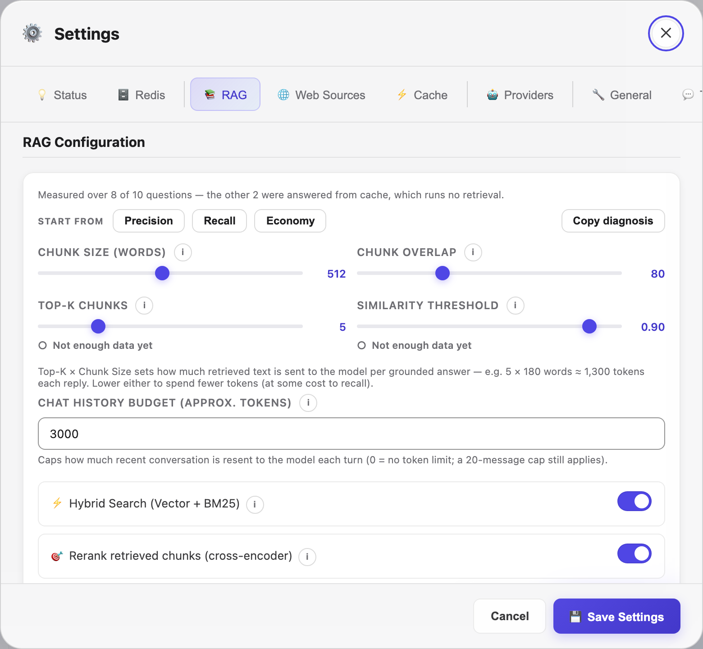
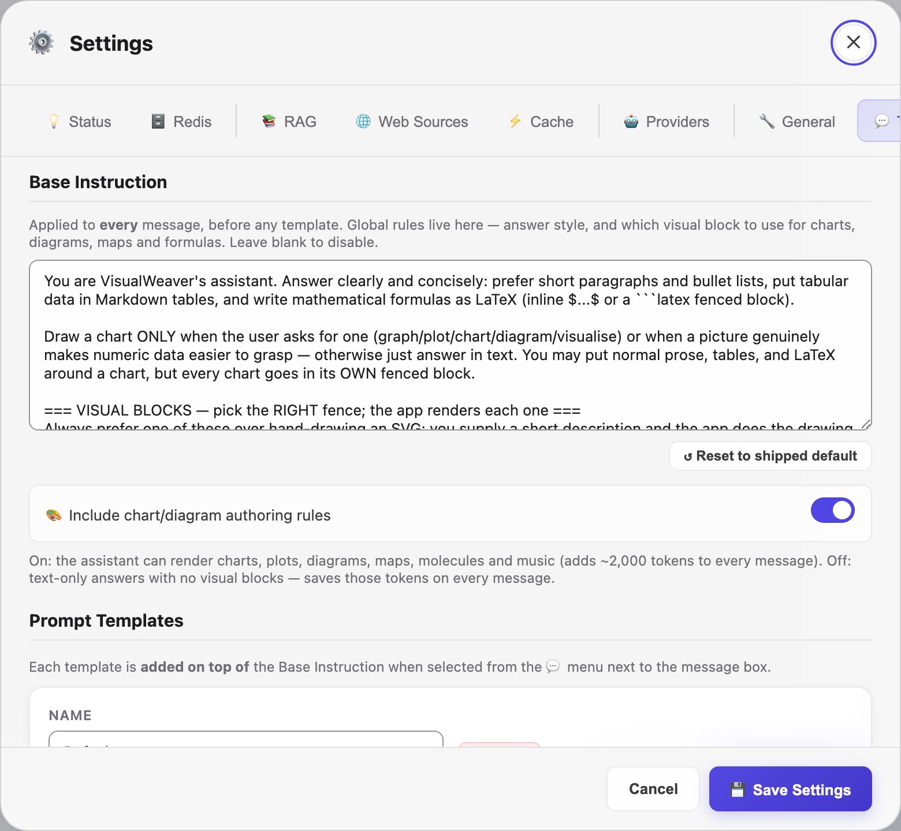

# VisualWeaver — Settings Reference

This document explains the main settings in the application: what each controls, its default value, acceptable range, and what changing it implies. A few advanced options (HyDE, scheduled re-crawl, session persistence) have **no UI control** — they are set by hand-editing `config.json`; see the notes where each is mentioned.

---

## Table of Contents

1. [How this panel saves](#how-this-panel-saves)
2. [Redis Connection](#redis-connection)
3. [RAG Settings](#rag-settings)
4. [Semantic Cache Settings](#semantic-cache-settings)
5. [Provider Settings](#provider-settings)
6. [General / UI Settings](#general--ui-settings)
7. [Web Crawler Settings](#web-crawler-settings)
8. [Scheduled Re-crawl](#scheduled-re-crawl)
9. [Watched Folders](#watched-folders)
10. [Token Usage](#token-usage)
11. [Prompt Templates & Base Instruction](#prompt-templates--base-instruction)
12. [Security Settings](#security-settings)

---

## How this panel saves

Two kinds of control live here:

- **Staged until you press 💾 Save Settings** — everything on this page unless noted below, plus the selected provider.
- **Applied the moment you change them** — RAG instances (create, delete, enable, reset) and Redis endpoints. Those sections say so in place.

Editing a staged control marks the panel **Unsaved changes**; closing it with Cancel, Escape or a click outside then asks before discarding. Switching provider takes effect in the browser immediately but is only remembered once you save.

---

## Redis Connection

Found in **Settings → Redis**.

### Host
- **Default:** `localhost`
- **What it does:** The hostname or IP address of your Redis server.
- **Notes:** Use `localhost` for a local installation. For Redis Enterprise or a remote server, use the full hostname (e.g. `redis-12345.mycloud.com`).

### Port
- **Default:** `6379`
- **What it does:** The TCP port Redis is listening on.
- **Notes:** `6379` is the generic default for an external Redis. VisualWeaver's own bundled local instance runs on `127.0.0.1:6389`. Redis Enterprise databases often use ports in the 10000–19999 range.

### Database Index
- **Default:** `0`
- **What it does:** Redis supports multiple logical databases (0–15) within a single server. Each has its own keyspace.
- **When to change:** Use a non-zero index to isolate this app from other software sharing the same Redis instance.
- **Notes:** Redis Enterprise does not support multiple databases per endpoint — leave this at `0`.

### Password
- **Default:** (empty)
- **What it does:** The `AUTH` password for the Redis server. VisualWeaver's bundled local instance runs on loopback with no password.
- **Notes:** Stored in `config.json`, which lives in the platform data directory (outside the repo), not the project tree. Only the Redis **host and port** can be overridden from the environment — `VISUALWEAVER_REDIS_HOST` / `VISUALWEAVER_REDIS_PORT` (used by the Docker image).

### SSL / TLS
- **Default:** Off
- **What it does:** Wraps the connection in TLS. Required for Redis Enterprise Cloud and most managed Redis services.
- **Notes:** When TLS is on, the server certificate **is** verified (redis-py's default), so a self-signed or untrusted certificate is rejected unless it chains to a trusted CA. Mutual TLS is not configurable from the UI.

### Additional Endpoints
Multiple Redis servers can be registered under custom names. Each RAG instance can then be assigned to a specific endpoint, allowing horizontal scaling across different Redis servers.

---

## RAG Settings

Found in **Settings → RAG**.

### Chunk Size
- **Default:** `180` words
- **Range:** 64 – 2048 words (practical) — but see the model limit below
- **What it does:** Controls the target size of each text chunk stored in the knowledge base. Text is split at sentence boundaries, so actual chunk sizes vary slightly. Content with no sentence punctuation (CSV rows, tables, code) is split on line boundaries instead, and no chunk may exceed twice this value.
- **⚠️ Bounded by the embedding model.** Each model encodes at most a fixed number of tokens — `intfloat/multilingual-e5-small` handles **256 tokens ≈ 190 English words** — and silently truncates the rest. Text past the limit is still stored and shown to the model, but is **not in the vector**, so semantic search cannot find it. Raising this above the model's limit therefore *reduces* recall while appearing to add context. VisualWeaver warns in the log when the configured size exceeds the active model's limit, and lowers a saved value that is already over it.
- **Smaller values (e.g. 128–256):**
  - More precise retrieval — each chunk covers a narrower topic
  - Higher storage requirements (more chunks)
  - Better for FAQ-style content or short factual passages
  - May lose context for answers requiring broader paragraphs
- **Larger values (e.g. 512–1024):**
  - More context per chunk — better for narrative or technical prose
  - Fewer chunks to store
  - May dilute the relevance score if the chunk covers multiple unrelated topics
- **Rule of thumb:** Leave at 180 for `intfloat/multilingual-e5-small`. If you switch to a model with a larger context (e.g. `all-mpnet-base-v2`, 384 tokens), you can raise it proportionally.

### Chunk Overlap
- **Default:** `32` words
- **Range:** 0 – (chunk_size / 2)
- **What it does:** The number of words at the end of one chunk that are repeated at the start of the next. This prevents answers from being cut off at chunk boundaries.
- **Example:** With chunk_size=180 and overlap=32, chunk 2 starts with the last ~32 words of chunk 1. A question whose answer spans a chunk boundary can still retrieve both halves.
- **0 overlap:** Maximum storage efficiency. Some answers near boundaries may be missed.
- **Large overlap (128+):** Better boundary coverage at the cost of more storage and potential duplicate content in search results.
- **Rule of thumb:** Keep at 32 unless you frequently see answers that seem truncated mid-sentence.

### Top-K
- **Default:** `5`
- **Range:** 1 – 20
- **What it does:** The maximum number of chunks retrieved from Redis and injected into the LLM prompt for each query.
- **Lower values (1–3):**
  - Shorter prompts → faster LLM responses, lower cost for API providers
  - Riskier: if the most relevant chunk is not in the top-1/3, the answer may be incomplete
- **Higher values (5–10):**
  - More context for the LLM → better answers for complex questions requiring multiple sources
  - Longer prompts → higher latency and API cost
  - Beyond 10, you risk filling the context window with marginally relevant content, potentially confusing the model
- **Rule of thumb:** 5 is a good default. Increase to 8–10 for research-style questions. Drop to 3 for fast, factual lookups.
- **Token cost:** roughly `Top-K × Chunk Size` words of retrieved text reach the model per grounded answer — the default 5 × 180 ≈ 1,300 tokens each reply, billed on paid providers. The RAG settings panel shows this estimate beneath the sliders; lower either knob to spend fewer tokens (at some cost to recall).

### Similarity Threshold
- **Default:** `0.35`
- **Range:** 0.0 – 1.0
- **What it does:** The minimum cosine similarity score a chunk must achieve to be sent to the LLM. Chunks below this score are retrieved from Redis but discarded before prompt assembly. Chunks that matched the keyword (BM25) half of hybrid search are exempt — they were selected lexically, so a cosine bar is the wrong gate for them.
- **Cosine similarity scale — calibrate to your model.** The absolute numbers are much lower than intuition suggests. Measured with the default `intfloat/multilingual-e5-small` over a real documentation corpus, genuinely relevant question↔passage pairs score **0.35 – 0.75**, with a typical best match around **0.60**. Scores above 0.85 essentially mean near-duplicate text.
  - `0.75+` — near-duplicate; almost nothing clears this in practice
  - `0.50 – 0.70` — a normal good match
  - `0.35` — weak but often still useful (default)
  - `< 0.25` — probably noise
- **Too high (e.g. 0.90):**
  - Only very close paraphrases of indexed content will retrieve chunks
  - High miss rate — many questions return no RAG context
  - Use when you want the model to answer only from content that very closely matches the query
- **Too low (e.g. 0.50):**
  - Almost everything retrieves chunks
  - Risk of injecting irrelevant content into the prompt, degrading answer quality
  - May cause the model to "hallucinate" answers that blend relevant and irrelevant chunks
- **Diagnosing:** Check **Settings → Analytics → RAG Performance**. If *Avg Best Raw* is comfortably above the threshold but *Hit Rate* is low, the threshold is too high. A quick check: turn **Hybrid Search** off — if retrieval then returns nothing at all, the threshold is filtering out every vector match and hybrid search has been carrying retrieval on its own.

### Hybrid Search
- **Default:** On
- **What it does:** Runs both vector KNN search (semantic) and BM25 full-text search (keyword) simultaneously, then merges results using Reciprocal Rank Fusion (RRF).
- **With hybrid search on:**
  - Exact keywords are reliably found even when their embedding similarity is borderline
  - Paraphrases and conceptual matches are found even without exact word overlap
  - Best of both worlds: semantic + lexical retrieval
- **With hybrid search off:**
  - Only vector KNN is used
  - Exact keywords in the query may fail to retrieve chunks that use those keywords verbatim, if the cosine score is below threshold
  - Slightly faster
- **When to disable:** Almost never. Disable only if you are debugging or benchmarking vector-only retrieval.

### Chat History Budget
- **Config key:** `history_max_tokens`
- **Default:** `3000` (approximate tokens)
- **What it does:** Caps how much of the recent conversation is resent to the model on each turn. Older turns beyond the budget are dropped (newest kept first); a hard cap of the last **20 messages** always applies as a backstop. Retrieved RAG chunks are *not* part of this — only the prior questions and answers.
- **Why it matters:** Without a size cap, a few verbose earlier answers (a large table, a chart's JSON) get re-billed as input tokens on every subsequent turn. The budget bounds that on paid providers, at the cost of shorter recalled context.
- **`0`** disables the token cap (the 20-message backstop still applies). Raise it for long, detail-heavy conversations; lower it to trim tokens.

---

## Semantic Cache Settings

Found in **Settings → Cache**.

### Enabled
- **Default:** On
- **What it does:** Toggles the entire semantic cache on or off.
- **When to disable:** During development or testing when you always want fresh LLM responses. When experimenting with different prompts or RAG configurations and do not want stale answers.

### Similarity Threshold
- **Default:** unset — the value follows the embedding model
- **Range:** 0.0 – 1.0
- **What it does:** The minimum cosine similarity between the current query and a cached query for a cache hit to be returned.
- **Set by the model when unset:**

  | Embedding model | Threshold |
  |---|---|
  | `all-MiniLM-L6-v2` | 0.93 |
  | `multilingual-e5-small` | 0.98 |
  | `multilingual-e5-base` | 0.98 |
  | `bge-m3` | 0.93 |
  | anything else | 0.98 |

- **The number is not portable between models.** Two questions about entirely different
  subjects score about 0.10 apart under `all-MiniLM-L6-v2` and about 0.80 apart under
  `multilingual-e5-base`. A threshold that is merely permissive under the first admits
  unrelated questions under the second, so changing the embedding model resets this
  setting along with the cached entries.
- **Lowering it** raises the hit rate and, past the values above, starts returning answers
  to questions that were not asked. The two mistakes are not equal: a wrong hit answers
  something you did not ask, a miss costs one model call.
- **What no threshold fixes.** Questions differing in one decisive word — *enable* against
  *disable*, *Q1* against *Q2*, *back up* against *restore* — score higher than most
  genuine rewordings. The defaults above are chosen to exclude them, which is why the hit
  rate is deliberately modest.
- **Setting it yourself** is respected and kept until the embedding model changes. The set
  the defaults were measured on is `tests/fixtures/cache_calibration.py`, so you can
  re-run the measurement against your own questions.

### TTL (Time to Live)
- **Default:** `3600` seconds (1 hour)
- **Range:** 60 – 86400+ seconds
- **What it does:** After this many seconds, a cache entry expires and is automatically deleted from Redis. Subsequent identical queries go to the LLM.
- **Short TTL (e.g. 300s):**
  - Cache entries expire quickly
  - Good for frequently changing data (news, live metrics)
  - Higher LLM usage
- **Long TTL (e.g. 86400s = 1 day):**
  - Entries persist longer — higher hit rate over time
  - Risk: stale answers if your underlying data changes
  - Good for stable reference documentation
- **TTL = 0:** Entries never expire (until cleared manually or Redis evicts them under memory pressure). Use only for truly static knowledge bases.

---

## Provider Settings

Found in **Settings → Providers** (accordion). Each provider card is expanded by clicking its header.

### Ollama

#### Host
- **Default:** `http://localhost`
- **What it does:** Base URL of the Ollama API server.
- **Notes:** Include the protocol (`http://` or `https://`). Do not include the port here — use the Port field.

#### Port
- **Default:** `11434`
- **What it does:** TCP port Ollama is listening on.
- **Notes:** Only change if you started Ollama with a custom `--port` flag.

#### Model
- **What it does:** The Ollama model name used for chat completions (e.g. `llama3.2`, `mistral`, `llava`).
- **Vision detection:** Models whose name contains `llava`, `bakllava`, `moondream`, `vision`, `minicpm`, `gemma3`, or `qwen-vl` are automatically detected as vision-capable and the 📎 image attach button is shown.

#### Manage models
- **Available Models table:** every model installed on the Ollama server, with size and vision capability. **Use** switches to it; **🗑** removes it from the server (frees its disk space — pulling again re-downloads).
- **Pull a model:** enter any name from the Ollama library (e.g. `llama3.2`, `qwen2.5:7b`) and click **⬇ Pull**; download progress streams live below the field.

---

### Claude (Anthropic)

#### API Key
- **What it does:** Your Anthropic API key (starts with `sk-ant-`).
- **Security:** Prefer setting `ANTHROPIC_API_KEY` as an environment variable. If set this way, the field shows a placeholder and the key is never written to `config.json`.

#### Model
- **Default:** `claude-sonnet-4-6`
- **Available models:** `claude-opus-4-6`, `claude-sonnet-4-6`, `claude-haiku-4-5`, and older versions.
- **Cost/capability tradeoff:**
  - Opus: highest capability, highest cost
  - Sonnet: balanced — best for most workloads
  - Haiku: fastest, lowest cost, lower capability

#### Base URL
- **Default:** `https://api.anthropic.com`
- **When to change:** If you use an Anthropic proxy, an on-premise gateway, or a third-party service that provides Claude access at a different endpoint.

---

### OpenAI

#### API Key
- **What it does:** Your OpenAI API key (starts with `sk-`).
- **Security:** Prefer `OPENAI_API_KEY` environment variable.

#### Model
- **Default:** `gpt-4o`
- **Notable options:** `gpt-4o`, `gpt-4o-mini`, `gpt-4.1`, `o3`, `o4-mini`
- **o-series models:** Reasoning models (`o3`, `o4-mini`) do not support streaming in the same way. Use standard GPT-4o for best streaming experience.

#### Base URL
- **Default:** `https://api.openai.com`
- **When to change:** Point to any OpenAI-compatible API — Azure OpenAI, LM Studio, Together AI, local inference servers, etc.
- **Example values:**
  - `http://localhost:1234` — LM Studio
  - `https://api.together.xyz` — Together AI
  - `https://my-azure.openai.azure.com` — Azure (requires additional setup)

---

### Qwen (Alibaba DashScope)

#### API Key
- **What it does:** Your DashScope API key.
- **Security:** Prefer `DASHSCOPE_API_KEY` environment variable.

#### Model
- **Default:** `qwen-plus`
- **Options:** `qwen-plus`, `qwen-max`, `qwen-turbo`, `qwen-long`
- **Tradeoff:** `qwen-max` is most capable; `qwen-plus` (the default) balances quality and cost; `qwen-turbo` is fastest and cheapest; `qwen-long` supports very long contexts.

#### Base URL
- **Default:** `https://dashscope.aliyuncs.com/compatible-mode/v1`
- **Notes:** This URL already includes `/v1`. Do not modify unless DashScope changes their endpoint structure.

---

### Groq

#### API Key
- **What it does:** Your Groq API key (starts with `gsk_`).
- **Security:** Prefer `GROQ_API_KEY` environment variable.

#### Model
- **Default:** `llama-3.3-70b-versatile`
- **Options:** Various Llama 3.x, Mixtral, Gemma 2, and other open models hosted by Groq
- **Notes:** Groq's main selling point is inference speed — responses often arrive in under a second. The free tier has rate limits (RPM and TPM); if you hit them, wait a moment and retry.

#### Base URL
- **Default:** `https://api.groq.com/openai`
- **Notes:** The SDK appends `/v1` automatically. Only change if Groq updates their API endpoint.

---

### Mistral

#### API Key
- **What it does:** Your Mistral API key.
- **Security:** Prefer the `MISTRAL_API_KEY` environment variable.

#### Model
- **Default:** `mistral-small-latest`
- **Options:** `mistral-large-latest`, `mistral-small-latest`, and other Mistral chat models.
- **Notes:** OpenAI-compatible and EU-hosted, with a free "Experiment" tier. Get a key at [console.mistral.ai](https://console.mistral.ai).

#### Base URL
- **Default:** `https://api.mistral.ai/v1`
- **Notes:** An OpenAI-compatible endpoint. Only change if Mistral updates their API.

---

### Gemini (Google AI)

#### API Key
- **What it does:** Your Google AI API key (starts with `AIza`).
- **Security:** Prefer `GEMINI_API_KEY` environment variable.

#### Model
- **Default:** `gemini-3-flash-preview`
- **Options:** the UI dropdown lists `gemini-3-flash-preview`, `gemini-2.5-flash-preview`, `gemini-2.5-pro-preview`, `gemini-2.0-flash`, `gemini-2.0-flash-lite`, `gemini-1.5-pro`, `gemini-1.5-flash`
- **Tradeoffs:**
  - Flash models: fastest, good quality, best value
  - Pro models: highest capability and largest context, higher cost
  - Vision: current Gemini models support image input natively
- **Notes:** Uses the `google-genai` native SDK with async streaming.

---

## General / UI Settings

Found in **Settings → General**.

### Theme
- **Default:** `auto`
- **Options:** `auto`, `light`, `dark`
- **`auto`:** Follows the operating system's dark/light mode preference.

### Embedding Model
- **Default:** `intfloat/multilingual-e5-small`
- **Options:**

| Model | Dimensions | Speed | Quality | Use case |
|---|---|---|---|---|
| `intfloat/multilingual-e5-small` | 384 | Very fast | Good | General default |
| `all-mpnet-base-v2` | 768 | Moderate | Better | Higher accuracy |
| `paraphrase-multilingual-MiniLM-L12-v2` | 384 | Fast | Good | Non-English content |
| `BAAI/bge-base-en-v1.5` | 768 | Moderate | High | English, best quality |

- **Critical:** Changing the embedding model after indexing data **breaks all existing RAG indexes**. The vector dimensions change, so queries against old data will return nonsense. After changing the model, you must clear and re-ingest all RAG instances.
- **Larger models (768d):** Better retrieval quality at the cost of roughly 2× storage and slightly slower embedding at ingest time.

### Max Image Dimension
- **Default:** `1024` pixels
- **What it does:** Images attached to messages are resized (preserving aspect ratio) so the longest edge is at most this many pixels before being sent to the model.
- **Lower values (e.g. 512):** Smaller payloads, faster uploads, lower API cost. Use when image detail is not critical.
- **Higher values (e.g. 2048):** Preserves more detail — useful for reading text in images, detailed diagrams, or medical imagery.
- **Notes:** Most vision models do their own internal resizing. This setting primarily controls bandwidth and API payload size.

### Show RAG Matches in Answers
- **Default:** Off
- **What it does:** When on, the RAG chunk inspector expands automatically below every response that used RAG. When off, the inspector is collapsed — but still accessible by clicking the **📚 N matched chunks** badge.
- **When to enable:** During development or tuning, when you want to see retrieval quality on every response without manually clicking.
- **When to leave off:** Normal use — the badge is always visible; you can open it on demand.

---

## Web Crawler Settings

Found in **Settings → Web Sources** when configuring a URL crawl.

### Depth
- **Default:** `0` (page only)
- **Range:** 0 – 3
- **What it does:** How many link-hops to follow from the starting URL.
  - `0`: Only the starting URL itself is fetched. Single-page ingest.
  - `1`: The starting URL plus all links found on it.
  - `2`: Everything at depth 1, plus all links found on those pages.
  - `3+`: Exponential page count — use with Max Pages to avoid runaway crawls.
- **Rule of thumb:** Use depth 0–1 for specific pages, depth 1–2 for small sites, `llms.txt` manifests with depth 0 (the manifest handles link resolution internally).

### Max Pages
- **Default:** `0` (unlimited)
- **Range:** 0 – 500 (0 = unlimited)
- **What it does:** Caps the total number of pages fetched in a single crawl. The crawl stops as soon as this limit is reached, regardless of depth.
- **0 = unlimited:** Risky for large sites at depth 2+. Always set a cap when crawling the open web.
- **Practical values:** 50–200 pages covers most documentation sites; the Redis `llms.txt` preset typically fetches 80–150 pages.
- **Progress readout:** with a cap set, the bar fills towards it (`25 of 100 pages`). With `0`, the bar shows pages *resolved* — indexed, skipped, blocked or failed — against pages *discovered so far* (`23 of 47 pages found so far · 18 indexed · 29 queued`). Both numbers grow as the crawl finds more links; a discovered page can end without being indexed if it was already indexed, was duplicate content, or is disallowed by `robots.txt`.

### Respect robots.txt
- **Default:** On
- **What it does:** When on, the crawler reads the target site's `robots.txt` file and skips disallowed paths.
- **Leave on:** For external sites, so the crawler behaves as a good citizen and avoids private or admin paths.
- **When to turn off:** For your own internal sites whose `robots.txt` may block content you legitimately want to index.

### Local Links Only
- **Default:** On
- **What it does:** Restricts the crawler to only follow links within the same domain (e.g. if you start at `docs.example.com`, it won't follow links to `github.com`).
- **Note:** links listed in an `llms.txt` manifest are always followed regardless of this setting (manifests intentionally point across domains).

### Smart Mode
- **Config key:** `crawl.smart_mode`
- **Default:** On
- **What it does:** Fetches each page with fast `httpx` first and only escalates to a full browser render (Playwright) when the page looks JavaScript-dependent — the best balance of speed and coverage for most sites. This is the default crawl strategy.
- **When to turn off:** Rarely — only to force one specific strategy (see Force JS below).

### Force JS (JS Rendering)
- **Config key:** `crawl.js_render`
- **Default:** Off
- **What it does:** Renders **every** page in a headless browser (Playwright), for single-page apps and sites that build their content with JavaScript. Slower and heavier than Smart Mode.
- **Requires** the crawl extras: `pip install '.[crawl]'` and `playwright install chromium`. Without them this mode is unavailable.

### Concurrency
- **Config key:** `crawl.concurrency`
- **Default:** `10`
- **What it does:** Maximum number of pages fetched in parallel over `httpx`. Higher is faster but heavier on the target site and your machine; lower is gentler.

### JS Concurrency
- **Config key:** `crawl.js_concurrency`
- **Default:** `3`
- **What it does:** Maximum number of simultaneous headless-browser tabs when JS rendering is used. Kept lower than `concurrency` because each browser tab is far more resource-intensive than an `httpx` fetch.

---

## Scheduled Re-crawl

*(Settings → Web Sources → Scheduled Re-crawl; config key `recrawl` and `scheduled_sources`)*

- **Enable scheduled re-crawl:** global on/off toggle (`recrawl.enabled`, default off). Saved with **Save Settings**.
- **Every N min:** `recrawl.interval_minutes`, default 60. Saved with **Save Settings**.
- **Schedule Current URL:** adds whatever is in the crawl URL box to the schedule, against the instance and depth selected beside it. Re-adding an existing URL replaces its entry. Applied immediately — it does not wait for Save Settings.
- **Re-crawl All Now:** runs every scheduled source at once in the background, ignoring the interval.
- **Behaviour:** the scheduler wakes once a minute and re-crawls a source when `interval_minutes` has elapsed since its last run. Pages whose content has not changed are skipped, so re-crawling an unchanged site is cheap. Removing a source only cancels the timer — pages already indexed from it stay in the knowledge base.

---

## Watched Folders

*(Settings → Web Sources → Watched Folders; config key `watch_folders`)*

- **Enable folder watching:** global on/off toggle (`watch_folders.enabled`, default off).
- **Scan every N min:** `watch_folders.interval_minutes`, default 5.
- **Folders:** each row maps an absolute local folder to a RAG instance. New and changed supported files (`.txt .md .csv .pdf .docx .xlsx`) under it — recursively, skipping dot-directories — are ingested automatically. An edited file **replaces** its previous version; files deleted from disk **stay indexed** until removed via Documents.
- **Reach:** everything readable under a watched folder becomes retrievable through chat. On a machine shared over the network, watch specific folders rather than broad roots (the app itself has no authentication by default).

---

## Token Usage

- The topbar shows this session's tokens: **↑ input · ↓ output · Σ total**. Exact numbers are the provider's own reported billed counts (stored with each answer); a `~` marks a session where at least one turn had to be estimated (≈ characters ÷ 4). Measured input counts the *full prompt the provider processed* — system prompt, re-sent history, retrieved context — so it grows with conversation length.
- **All-time totals** live in **Analytics → 🔢 Token Usage**: every provider and model since the counter was last reset, with fresh input, cache reads, cache writes and output as separate columns, ordered by total tokens. `GET /api/usage` returns the same tally; `DELETE /api/usage` (the card's **Reset tally** button) zeroes it without touching your conversations.
- **No cost figure.** VisualWeaver reports tokens only. Provider rates vary by model and change without notice, so an estimate baked into the app would go stale silently and read as an authority it is not — price these counts against your provider's own billing page.

---

## Prompt Templates & Base Instruction

Found in **Settings → 💬 Templates**.

### Base Instruction

- **Config key:** `base_instruction`
- **Default:** the instruction shipped with this version (answer style, plus which visual block to use for charts, diagrams, maps, formulas and music)
- **What it does:** prepended to the system prompt of **every** chat turn, before any selected template. It is where global rules live — how answers should be formatted, and how to emit the fenced blocks that the app renders (see [DOCS.md](DOCS.md#rich-content-rendering)).
- **Leave it blank** to disable it entirely; the model then gets only the selected template (or a plain default).
- **↺ Reset to shipped default** replaces the box with the instruction that ships with the installed version. Use it after upgrading: once you have saved settings, your stored copy takes precedence over the shipped one, so newly supported block types would otherwise never be advertised to the model. You still have to click **Save Settings** afterwards.
- **Cost:** it is sent on every request, so its length counts toward input tokens on paid providers. Most of that length is the chart/diagram authoring section — use the toggle below to drop it wholesale rather than editing the text.

### Include Chart / Diagram Authoring Rules

- **Config key:** `visual_instructions`
- **Default:** On
- **What it does:** The shipped Base Instruction ends with a large (~2,000-token) section that teaches the model how to emit the app's chart / plot / diagram / map / molecule / music blocks. Turn this **off** on text-only deployments to stop sending that section on every message — the model still answers in Markdown, tables and LaTeX, but no longer produces rendered figures.
- **Cost:** ~2,000 input tokens saved per message when off, on paid providers. No effect on a blank Base Instruction, or on the text answers themselves.
- **Note:** it drops the section from the *shipped* instruction (a trailing block). A heavily customised Base Instruction that appends its own text *after* that section would lose it when this is off.

### Prompt Templates

- **Config key:** `prompt_templates` — a list of `{name, system}` objects
- Templates are **additive**: the effective system prompt is `base_instruction` + the selected template's text. Selecting one from the 💬 menu beside the message box does not replace the base.
- Use templates for personas or task-specific behaviour ("Redis expert", "ELI5"), and the Base Instruction for rules that should always apply.
- New templates start empty, so they only add to the base.

---

## Security Settings

Found in **Settings → Security**.

### Authentication

VisualWeaver has **no built-in authentication**. The Settings → Security "password" field is stored in `config.json` (as plaintext, in the platform data directory) but is **not currently enforced** — access is not gated on it.

By default the app binds to `127.0.0.1` (localhost only). Before exposing it on a LAN, VPN, or the internet, put it behind a **reverse proxy (nginx, Caddy) with HTTPS and authentication** — see [`deploy/docker-compose.https.yml`](deploy/docker-compose.https.yml) for a Caddy + automatic-HTTPS starting point, and add an auth layer there before exposing sensitive data.
