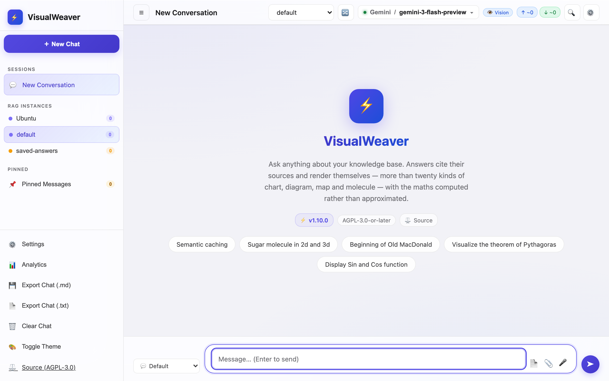
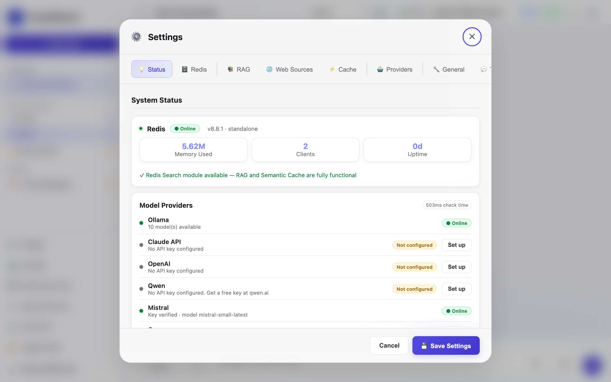
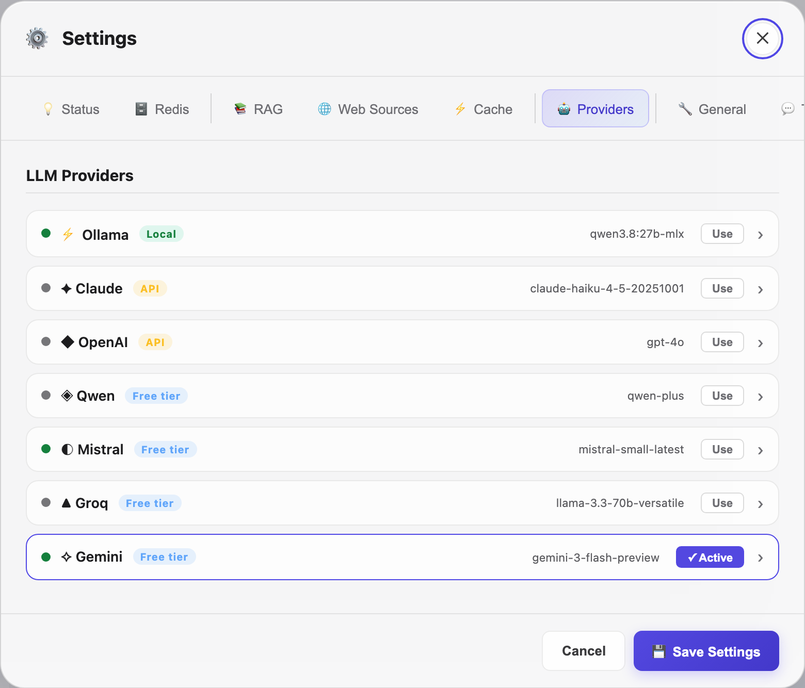
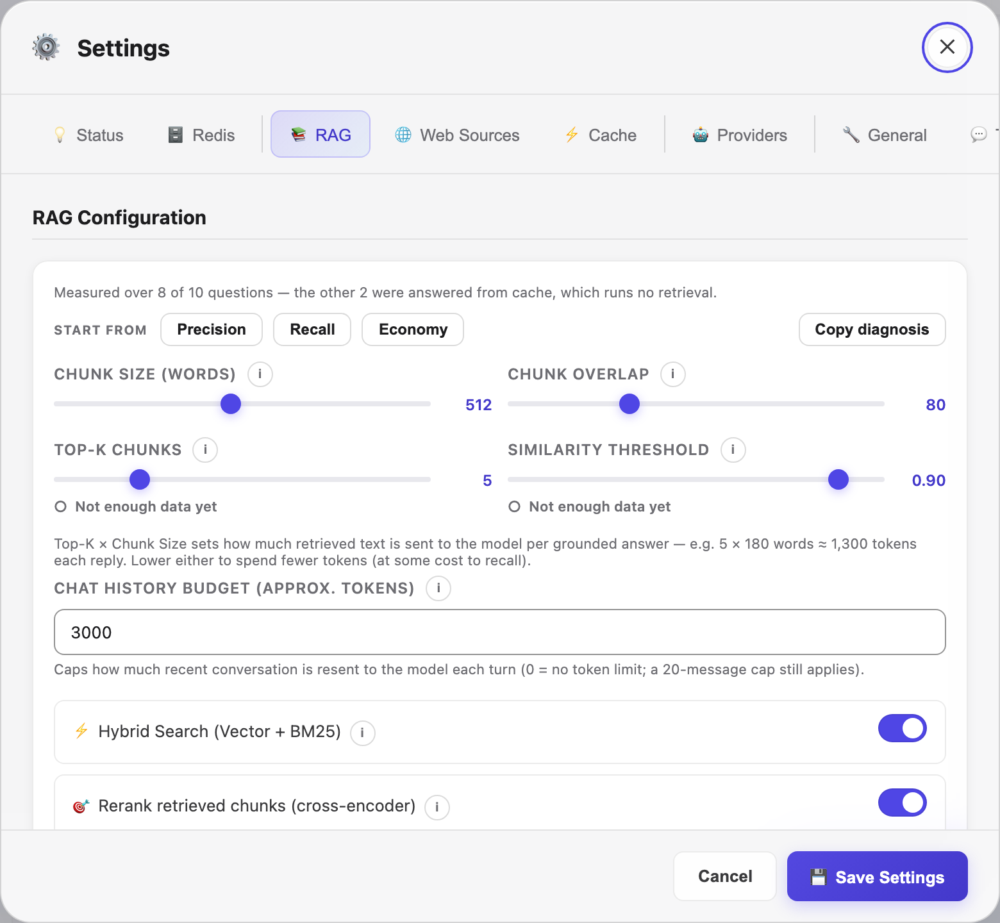
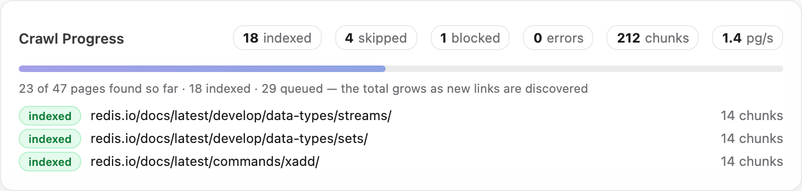
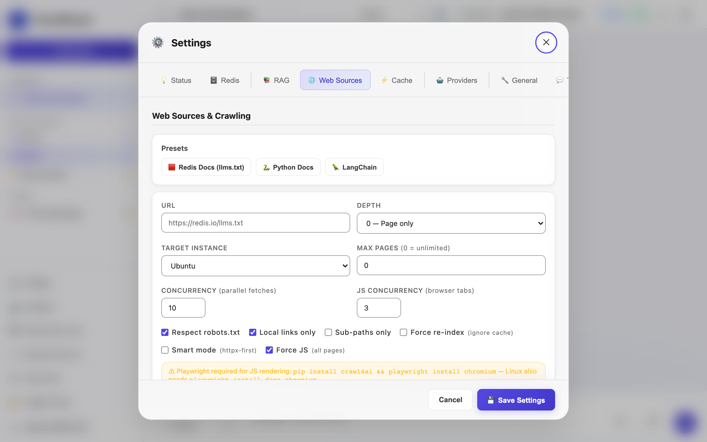
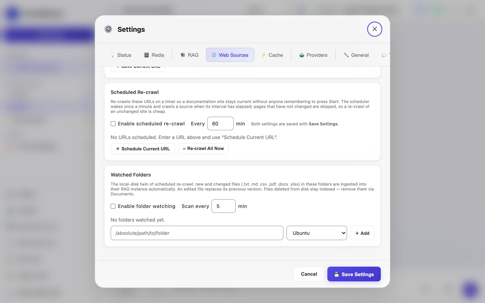
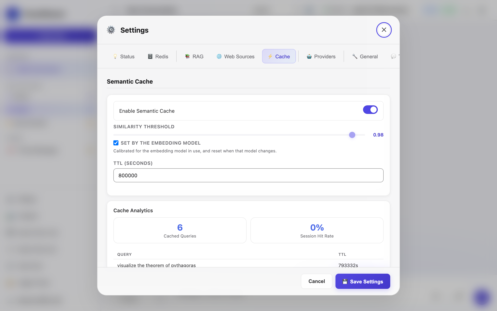
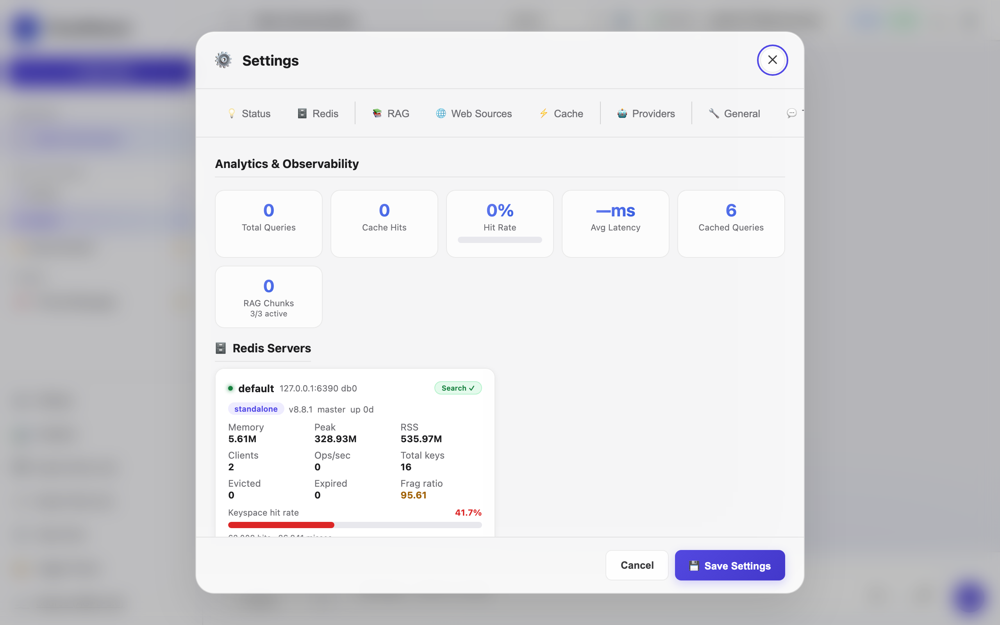
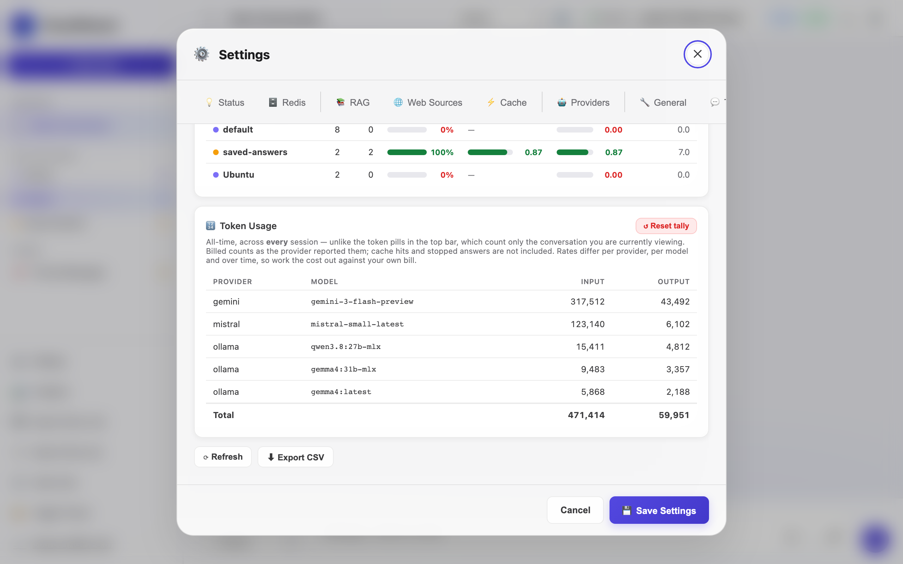

# VisualWeaver — Getting Started Tutorial

This tutorial walks you through the complete experience: installing the app, connecting a language model, building a knowledge base, and chatting with your data. Budget about 20–30 minutes on a first run — the ~90 MB embedding model, and optionally a headless-browser download, happen along the way.

Commands are shown for **macOS** and **Linux** side-by-side where they differ. Prefer containers? Skip to the [README's Docker section](readme.md#docker-simplest) for a two-command setup instead.

---

## Prerequisites

- **Python 3.11 or newer** — check with `python3 --version`.
- **git** *or* **unzip** — to obtain the code.
- **curl** — the start script uses it for a health check.
- **macOS only:** [Homebrew](https://brew.sh) and the Xcode Command Line Tools (`xcode-select --install`).
- **~500 MB free disk** — the virtualenv, the vendored Redis, and the embedding model (downloaded on first ingest).

No running Redis is required — `install.sh` provisions its own on port 6389.

---

## Step 0 — Get the code

Download the latest release and unzip it, **or** clone the repo, then open a terminal **inside that folder** — every command below is run from there:

```bash
# Option A — download the release zip from
#   https://github.com/SFCyris/VisualWeaver/releases/latest
unzip visualweaver-latest.zip && cd VisualWeaver

# Option B — clone with git
git clone https://github.com/SFCyris/VisualWeaver.git && cd VisualWeaver
```

---

## Step 1 — Install

One script sets up everything — a Python virtual environment, the app's dependencies, and a Redis 8 with the search/query engine, kept on its own port and separate from any Redis you already run:

**macOS and Linux:**
```bash
./install.sh
```

- On **macOS** it needs Homebrew (for `openssl@3`) and Xcode Command Line Tools; Redis 8 is vendored into `./.redis` so it never touches a system install.
- On **Linux**, if you already run a Redis with the search module it is reused; otherwise Redis 8 is installed for you.

The dedicated Redis runs on a loopback port (6389 by default), so it never conflicts with any Redis you already have. The default sentence-transformer embedding model (~90 MB) is downloaded and cached the first time you ingest content — not during install.

> **If it fails:** `python3 not found` or `Homebrew is required` → install those (see [Prerequisites](#prerequisites)) and re-run. If it reports the Redis **search module** did not load, re-run `./install.sh` — it re-locates the module.
> **Verify:** the script ends with a success banner and a `./.redis/` folder now exists.

> Prefer containers? Skip Steps 1–3 and run `docker compose pull && docker compose up -d` instead (pulls the prebuilt app image from GitHub + Redis). Stop with `docker compose stop`. See the README's Docker section for details.

---

## Step 2 — (Optional) Enable JS rendering for web crawling

Skip this step if you only need to crawl static HTML pages or `llms.txt` manifests — those use the fast httpx path and don't need a browser.

Only install this if you need to crawl JavaScript-rendered documentation sites (Docusaurus, VitePress, Next.js apps).

**macOS:**
```bash
./venv/bin/pip install '.[crawl]'
./venv/bin/playwright install chromium
```

**Linux:**
```bash
./venv/bin/pip install '.[crawl]'
./venv/bin/playwright install chromium
./venv/bin/playwright install-deps chromium    # installs system libs required by Chromium
```

**Linux — if `install-deps` misses anything:**
```bash
sudo apt-get install -y \
    libglib2.0-0 libnss3 libnspr4 libdbus-1-3 libatk1.0-0 \
    libatk-bridge2.0-0 libcups2 libdrm2 libxkbcommon0 \
    libxcomposite1 libxdamage1 libxfixes3 libxrandr2 \
    libgbm1 libasound2
```

> The `--no-sandbox` Chromium flag required in Linux containers is added automatically by the app — you don't need to configure it.

---

## Step 3 — Start the app

**macOS and Linux:**
```bash
./start.sh
```

This starts the dedicated Redis, then the app. Open **http://localhost:8420** in your browser — you should see the chat interface with a glass-effect sidebar.



- Stop everything (app **and** its Redis): `./stop.sh`
- Restart: `./restart.sh`
- Use a different port: `./start.sh 9000`

> **If the page doesn't load or the port is busy** (`Port 8420 is already in use`), start on another port: `./start.sh 9000`, then open `http://localhost:9000`. Check the app log path printed in the start banner for errors.
> **Verify:** `curl -fsS http://localhost:8420/api/health` returns an `ok` status.

The app binds to `127.0.0.1` (localhost) by default. There is no built-in authentication, so put a reverse proxy with auth in front before exposing it on a network (see `deploy/docker-compose.https.yml`).

---

## Step 4 — Verify Redis connection

1. Click the **⚙** settings icon (or press `⌘/Ctrl + K`)
2. Go to the **Status** tab
3. The Redis row should show a green dot and the Redis version



If it shows red, go to the **Redis** tab and update the host/port to match your setup.

---

## Step 5 — Configure a language model

Until a provider has a usable model, the welcome screen says so and links straight to the
two places that fix it — it will not offer prompts that cannot run.


Open **Settings → Providers**. Seven providers are available — pick one to start.



### Option A — Ollama (local, free, no API key)

**macOS:**
```bash
brew install ollama
ollama pull llama3.2
ollama serve
```

**Linux:**
```bash
curl -fsSL https://ollama.ai/install.sh | sh
ollama pull llama3.2
ollama serve   # or: sudo systemctl enable --now ollama
```

> **`ollama serve` blocks its terminal** — run it in a *separate* terminal from `./start.sh`. On macOS the Ollama app usually already runs the server, so `ollama serve` may say *"address already in use"* — that's fine, skip it.

In the Providers accordion, expand the **Ollama** card. Click **Test Connection** — it should show green. Click **Refresh Models**, select your model, and click **Use**.

> **If Test Connection is red:** confirm `ollama serve` is running (or the Ollama app is open) and the host in the card is `http://localhost:11434`.

### Option B — Cloud provider (API key required)

Expand any provider card (Claude, OpenAI, Groq, Qwen, Mistral, or Gemini), paste your API key, select a model, and click **Use**.

> **Tip:** Set API keys as environment variables before starting the server — they are never written to `config.json`:
> ```bash
> export ANTHROPIC_API_KEY=sk-ant-...
> export OPENAI_API_KEY=sk-...
> export GROQ_API_KEY=gsk_...
> export MISTRAL_API_KEY=...
> export GEMINI_API_KEY=AIza...
> export DASHSCOPE_API_KEY=sk-...   # Qwen
> ```
> On Linux, add these to `~/.bashrc` or `/etc/environment` to make them permanent.

Groq is a convenient option for getting started — it offers a free tier. Check the current pricing and rate limits on the Groq console.

### Save your settings

Click **💾 Save Settings** at the bottom of the Settings panel.

---

## Step 6 — Your first chat (no RAG)

Close Settings and type a message in the input box. Press Enter or click ➤.

The response streams token-by-token. Notice the badge showing latency and a **🔍 Live** indicator (cache miss on the first query).

Ask the same question again — this time you should see a **⚡ Cached XX%** badge. The response returns instantly from the semantic cache.

Hover an earlier question to reveal its **📋 Copy · ↻ Rerun · ↺ Force rerun** bar — *Rerun* may reuse the cache, *Force rerun* always asks the model again. The topbar dropdown selects which knowledge base to consult (that's **RAG** — you'll create one in Step 7); with none created yet it sits on **✦ All RAGs**, and you can pick **⊘ No RAG** any time to answer purely from the model with no retrieval.

---

## Step 7 — Create a RAG knowledge base

RAG (Retrieval-Augmented Generation) lets the model answer questions using your own documents.

1. Open **Settings → RAG**
2. Click **＋ New Instance**
3. Name it `my-docs`, pick any colour, leave the Redis endpoint as default
4. Click **Create**
5. In the topbar dropdown, select `my-docs`



---

## Step 8 — Ingest your first document

### From a file

1. Still in **Settings → RAG**, scroll to **Ingest Documents**
2. Select `my-docs` from the **Target Instance** dropdown
3. Drag a `.txt`, `.pdf`, or `.csv` file onto the upload zone (or click to browse)
4. Watch the progress bar — it shows per-file chunk counts in real time
5. **✕ Cancel** stops after the file being indexed; anything already indexed is kept

> **First run only:** before the first file is indexed the panel says the embedding model
> is downloading (about 90 MB). That happens once — later ingests start straight away.
> If you close the tab mid-ingest, reopening **Settings → RAG** re-attaches to the job
> still running on the server.

### From the web (Redis docs preset)

1. Go to **Settings → Web Sources**
2. Click the **🟥 Redis** preset button — this loads `https://redis.io/llms.txt`
3. Leave **Smart mode** checked (httpx-first, fast)
4. Click **🕷 Start Crawl** and watch pages ingest in real time with a live pages/sec rate

The progress bar reads `23 of 47 pages found so far · 18 indexed · 29 queued`. With
**Max Pages** left at `0` it counts pages *resolved* — indexed, skipped, blocked or failed
— against the pages the crawler has *discovered*, both of which grow as it finds more
links. A page can be discovered and then skipped: already indexed, duplicate content, or
disallowed by `robots.txt`. Set a page limit and the bar fills towards that instead. **⏸ Pause** holds between pages and keeps everything
indexed so far; **✕ Cancel** stops for good. Both act on the crawl named above the bar, so
you can start typing the next URL without disturbing the one that is running.





The `llms.txt` manifest lists the Redis documentation pages so the crawler can fetch them directly. Throughput depends on your network, the embedding model, and your hardware.

### Keeping a site up to date

Under **Scheduled Re-crawl** on the same tab, **＋ Schedule Current URL** puts the URL in the
box on a timer, against the instance and depth beside it. Turn on **Enable scheduled
re-crawl**, set the interval, and click **Save Settings** — the scheduler re-crawls each
source when its interval has elapsed, skipping pages that have not changed. **⟳ Re-crawl All
Now** runs every scheduled source immediately.



### Crawl modes explained

| Mode | When to use |
|---|---|
| **Smart mode** (default) | Most sites — tries fast httpx first, only uses browser for thin-content pages |
| **Force JS** | Fully client-rendered SPAs where httpx returns empty shells |
| Neither | Pure static HTML — maximum speed, no browser overhead |

> **Force JS requires the crawl extras from [Step 2](#step-2--optional-enable-js-rendering-for-web-crawling)** (`pip install '.[crawl]'` + `playwright install chromium`). If you skipped Step 2, use **Smart mode**, or install the extras first.
> **If a crawl returns 0 pages:** the site is likely JavaScript-rendered — retry with Force JS (after installing the extras), or lower the depth/check the URL.

---

## Step 9 — Chat with your data

Close Settings. Make sure `my-docs` is selected in the topbar dropdown.

Ask a question about something in your documents, e.g.:
- *"What is Redis Sorted Set?"* (after the Redis preset crawl)
- *"Summarise the key points from the document"*

After the response, look for the **📚 N matched chunks** badge. Click it to see exactly which passages were retrieved, their similarity scores, and their sources.

---

## Step 10 — Explore the RAG inspector

Expand the chunk inspector on any RAG response. Each chunk shows:
- **#n** — the number the answer cites it by. Click a `[2]` marker in the answer to open
  source `#2` and highlight it
- **Score** — cosine similarity (0–1, higher is better)
- **Source** — file name or URL
- **Text** — the exact passage injected into the LLM prompt

If chunks have low scores (< 0.5), the retrieval may be struggling. See [SETTINGS.md](SETTINGS.md) for tuning guidance.

---

## Step 10b — Finding things again

Press **Shift+⌘/Ctrl+F** for VisualWeaver's own search (plain ⌘/Ctrl+F stays with your
browser). It searches message text and the retrieved source passages, reports how many
matches it found, and with **All conversations** ticked it looks through every conversation
in the sidebar — clicking a result opens that conversation at the message.

Anything the app tells you is also kept under **Settings → Logs → Notifications** for the
rest of the session, so an error you missed can still be read.

---

## Step 10c — Keeping an answer worth keeping

When an answer is worth more than the conversation it appeared in, click **💾** on it.
Nothing else keeps it: the cache entry expires after an hour, the conversation after a day,
and 📌 Pin is gone on reload.

1. A dialog opens with the **question**, the **answer** and the **sources it cited**, all
   editable — trim anything you would not want quoted back to you months from now
2. Leave the knowledge base as `saved-answers` (created the first time you use it)
3. Click **💾 Save to knowledge base**


From then on the answer is retrieved like any other document, and shows up in the sources
panel labelled `answer://…` so you can always tell a kept answer from a real source.

> **Its own knowledge base.** A saved answer is retrieved and cited exactly like a
> document, and being phrased in the words of the question it can rank above the document
> it came from. Keeping saved answers in `saved-answers` means you can switch them off in
> the top-bar selector when you want an answer grounded only in real sources. Remove one at
> any time under **Settings → RAG → Documents**.

---

## Step 11 — Cache management

After a few queries, some responses will be cached. On any cached message (green ⚡ badge) you'll see two buttons:

- **🗑 Uncache** — Removes that entry from the cache. Useful if the answer was wrong or outdated.
- **↺ Re-run fresh** — Forces a new LLM call for this query, bypassing the cache. The fresh response replaces the old one in the cache.

The **Settings → Cache** tab shows cache analytics and lets you tune the similarity threshold and TTL or clear stored entries:



---

## Step 12 — Parallel RAG (advanced)

If you have multiple knowledge bases and want to query all of them at once:

1. Create a second RAG instance (e.g. `support-kb`) and ingest different documents into it
2. Make sure both instances are enabled (the **● On** toggle is lit in Settings → RAG)
3. Click the **🔀** button in the topbar
4. Ask a question — both instances are queried simultaneously and results are merged by relevance score

---

## Step 13 — Tune RAG quality

If retrieval isn't working well, open **Settings → Analytics → RAG Performance**. The table shows per-instance hit rates and scores.



| Symptom | Likely cause | Fix |
|---|---|---|
| Hit rate < 50%, Avg Best Raw > 0.6 | Threshold too strict | Lower similarity threshold (try 0.65) |
| Hit rate < 50%, Avg Best Raw < 0.4 | Wrong embedding model or low-quality content | Re-check chunking; try a larger embedding model |
| Correct content not retrieved | BM25 not helping | Enable Hybrid Search in Settings → RAG |
| Too many irrelevant chunks | Threshold too low | Raise similarity threshold (try 0.80) |

See [SETTINGS.md](SETTINGS.md) for the full explanation of every knob.

### Checking what you've used

Further down the same tab, the **🔢 Token Usage** card totals every conversation you have had, per provider and model:



This is the all-time figure. The token pills in the top bar count only the conversation you are looking at and reset when you switch, so the two will not match.

The card reports tokens, not money. Provider rates change without notice, so VisualWeaver does not guess at a price — take these counts to your provider's own billing page. **⬇ Export CSV** at the foot of the tab gives you the same rows in a spreadsheet.

---

## Step 14 — Export and backup your RAG

To save a knowledge base:

1. **Settings → RAG**, find your instance card
2. Click **⬇** to download a `.zip` containing all chunks and embeddings
3. To restore: click **⬆** on the same (or different) instance and upload the zip

No re-embedding needed — the vectors are stored in the export.

---

## Troubleshooting

| Symptom | Fix |
|---|---|
| `install.sh`: *python3 not found* / *Homebrew is required* | Install the missing tool (see [Prerequisites](#prerequisites)) and re-run. |
| Redis is up but **search unavailable** (Status tab) | Re-run `./install.sh` — it re-locates the Redis search module. |
| **Port 8420 already in use** / page won't load | `./start.sh 9000`, then open `http://localhost:9000`. |
| Ollama **Test Connection** red | Start `ollama serve` (or open the Ollama app); confirm host `http://localhost:11434`. |
| Cloud provider errors | Check the API key / its environment variable (see Step 5), and the model is selected + **Use** clicked. |
| Crawl returns **0 pages** | The site is likely JS-rendered — use **Force JS** (needs the Step 2 extras), or check the URL/depth. |
| Chat says a knowledge base was searched but found nothing (**📭 No KB match**) | Lower **Similarity Threshold** or raise **Top-K** in Settings → RAG; confirm the document ingested. |

---

## What's next?

- Read [SETTINGS.md](SETTINGS.md) to understand what every slider and option does
- Read [DOCS.md](DOCS.md) for the full technical reference including the REST API and WebSocket protocol
- Try a vision model with Ollama (`llava`) or Gemini and attach an image to your message
- Set up multiple Redis endpoints for horizontal scaling
- If you expose the app beyond loopback, put a reverse proxy with authentication in front of it — VisualWeaver has no built-in auth
