<p align="center"><strong>VisualWeaver</strong></p>

<p align="center">Self-hosted retrieval-augmented chat over your own documents and websites, backed by Redis vector search.</p>

<p align="center">
  Self-hosted &bull; Browser-based &bull; Bring your own LLM &bull; AGPL-3.0
</p>

<p align="center">
  <a href="LICENSE"></a>
  <a href="https://github.com/SFCyris/VisualWeaver/releases/latest"></a>
  <a href="https://github.com/SFCyris/VisualWeaver/pkgs/container/visualweaver"></a>
  
</p>

<p align="center">
  <strong><a href="https://github.com/SFCyris/VisualWeaver/releases/latest/download/visualweaver-latest.zip">⬇&nbsp; Download the latest release</a></strong>
  &nbsp;·&nbsp; <a href="https://github.com/SFCyris/VisualWeaver/releases/latest">release notes</a>
</p>

---

## What is VisualWeaver?

VisualWeaver is a self-hosted chat application that answers from **your** knowledge base. Point it at documents (PDF, DOCX, XLSX, TXT, CSV, Markdown) and websites, and it ingests them into a Redis vector index; when you chat, it retrieves the most relevant passages and grounds the model's answer in them (retrieval-augmented generation). 
Redis is also used for semantic caching, so similar queries are answered from the cache and don't waste tokens.

It runs entirely on your own machine — you bring your own LLM (a local **Ollama** model, or an API key for **Claude, OpenAI, Qwen, Mistral, Groq, or Gemini**), and your data never leaves your control.

**Runs on macOS and Linux.** Redis 8 (with the search/query engine) is set up for you automatically — no separate Redis install needed.

---

## Screenshots

Answers render richly **inline** — Markdown and tables, LaTeX math, SVG diagrams, exact function graphs, and even sheet music — right in the chat.

<p align="center">
  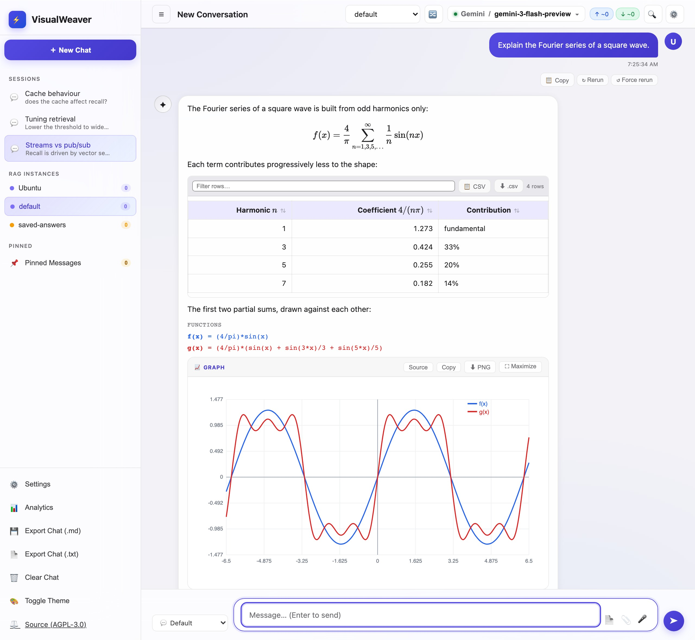
  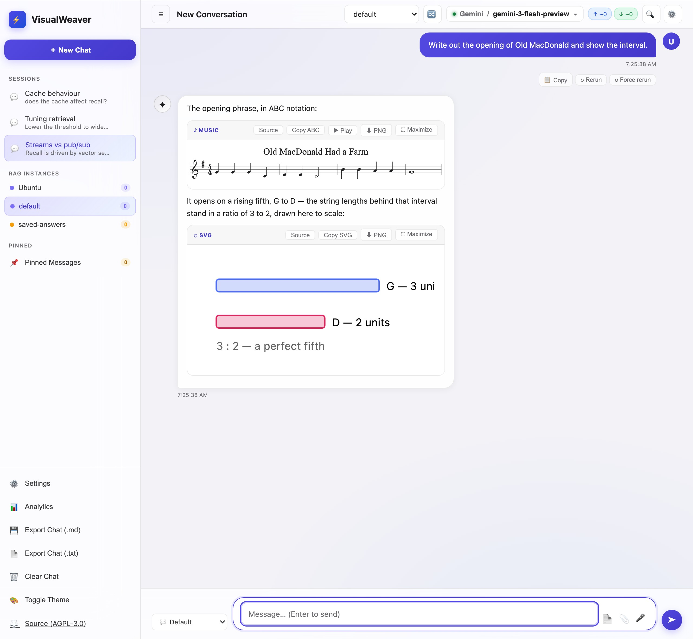
</p>

<p align="center"><sub>Left: LaTeX math, a table, and an exact function graph. &nbsp;&bull;&nbsp; Right: sheet-music notation and an SVG geometry diagram.</sub></p>

---

## What answers can render

The model writes a short, declarative block — the browser does the drawing. That keeps figures **accurate**, because the maths and layout never depend on the model getting pixels right.

| Fence | Renders | The model writes |
|---|---|---|
| ` ```plot ` | Function graph (exact) — also parametric, polar, vector-field, contour and implicit — with optional live parameter **sliders** | `y = a*sin(b*x)` + `param: a = 0.5 .. 3 (1)` |
| ` ```chart ` | Bar / line / pie / scatter / radar chart | Chart.js JSON |
| ` ```mermaid ` | Flowchart, sequence, class, state, ER, Gantt, mindmap, quadrant, XY chart, sankey, block, kanban | mermaid syntax |
| ` ```dot ` | Auto-laid-out graph (dependencies, call graphs) | Graphviz DOT |
| ` ```geometry ` | Geometric construction | points/lines/circles as JSON |
| ` ```map ` | Map with markers / GeoJSON | `center`, `zoom`, `markers` |
| ` ```plot3d ` | 3-D surface / scatter | Plotly JSON |
| ` ```fractal ` | Mandelbrot/Julia (drag/click to zoom), IFS, L-system curves, strange attractors — interactive iteration/depth | JSON: `type` + parameters |
| ` ```molecule ` | Chemical structure | a SMILES string |
| ` ```molecule3d ` | 3D structure, rotatable/zoomable | XYZ format (atoms + coordinates) |
| ` ```plotly ` | Histogram, box, violin, heatmap, contour, sankey, treemap, sunburst, candlestick, waterfall, funnel | Plotly figure JSON |
| ` ```ode ` | Phase portrait — direction field + trajectories, with optional **sliders** | `dx = y`, `dy = -sin(x)`, `start: 1, 0` |
| ` ```scene ` | 3-D scene of primitives — rotate, zoom, pan | JSON `objects` with `position`, `rotation`, `color` |
| ` ```sequence ` | DNA / RNA / protein sequence, or an alignment | FASTA or a bare sequence |
| ` ```phylo ` | Phylogenetic tree (phylogram or cladogram) | Newick |
| ` ```reaction ` | Reaction scheme drawn from structures | reaction SMILES |
| ` ```circuit ` | Electrical schematic on a grid | JSON `components` |
| ` ```gantt ` | Project schedule — dates, durations, dependencies | mermaid gantt syntax |
| ` ```timeline ` | Dated event sequence | mermaid timeline syntax |
| ` ```network ` | Force-directed graph, draggable nodes | JSON nodes + edges |
| ` ```geojson ` | Geographic features with popups | a GeoJSON FeatureCollection |
| ` ```abc ` | Sheet music, with a Play button | ABC notation |
| ` ```calc ` | Arithmetic, unit conversion, dates, matrices — **computed, not guessed** | `5 km/h to m/s` |
| ` ```solve ` | Symbolic algebra — derivative, simplify, roots | `derivative: x^3 + 2x` |
| ` ```stats ` | Descriptive statistics & linear regression | `data: 4, 8, 15, 16, 23` |
| ` ```table ` | Sortable / filterable table with **computed** totals + CSV export | JSON: `columns`, `rows`, `total` |
| ` ```diff ` | Real line diff of two texts | `--- before` … `--- after` … |
| ` ```regex ` | Runs a pattern against samples, highlights matches | `pattern:` + `test:` lines |
| ` ```truth ` | Truth table for a boolean expression | `(A and B) or not C` |
| ` ```latex ` / `$…$` | Math formulas | LaTeX |
| ` ```svg ` | Custom vector graphic | SVG (sanitised) |
| ` ```<language> ` | Syntax-highlighted code | code |

The bottom group (`calc`, `solve`, `stats`, `table`, `diff`, `regex`, `truth`) is computed in your browser rather than asserted by the model — so unit conversions, column totals and truth tables are exact instead of "usually right". Slider-equipped `plot` blocks re-graph instantly as you drag, with no new request to the model.

<p align="center">
  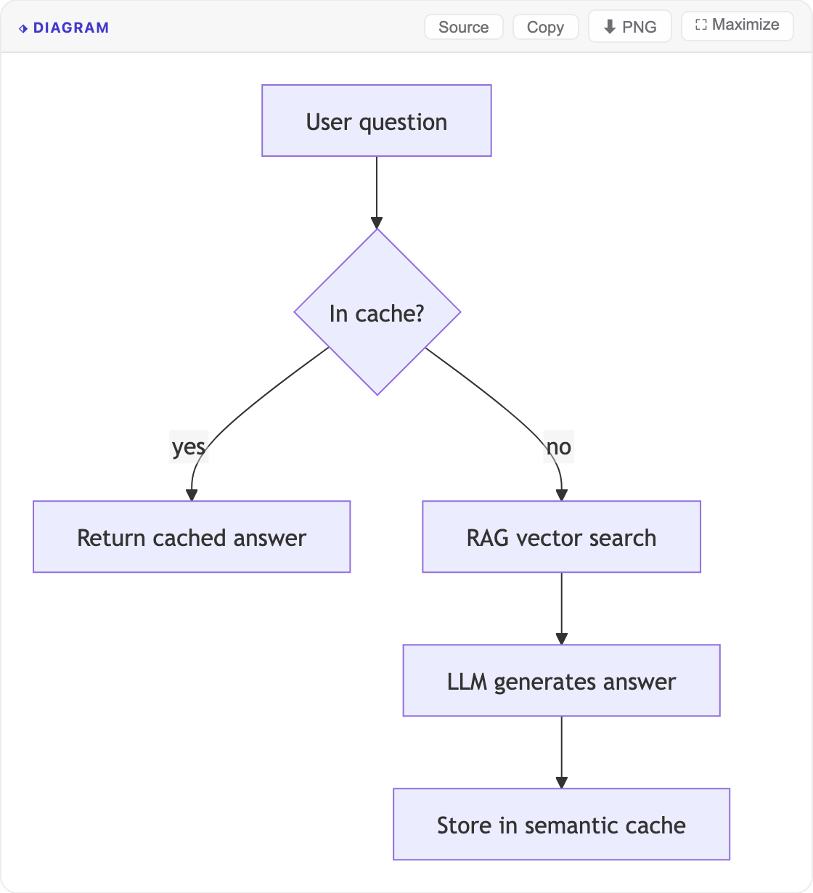
  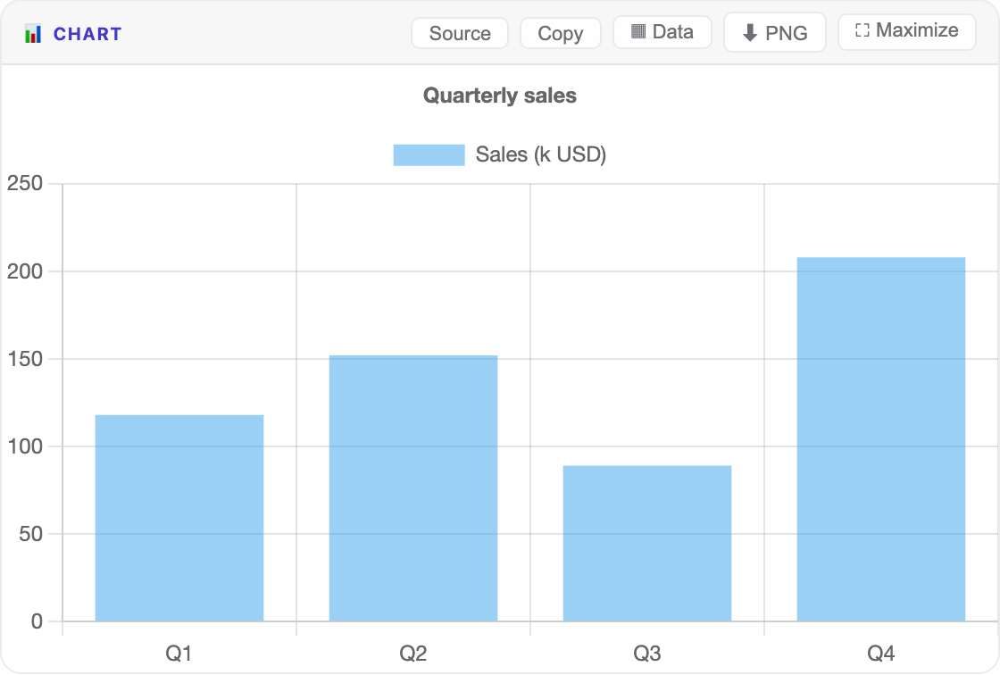
  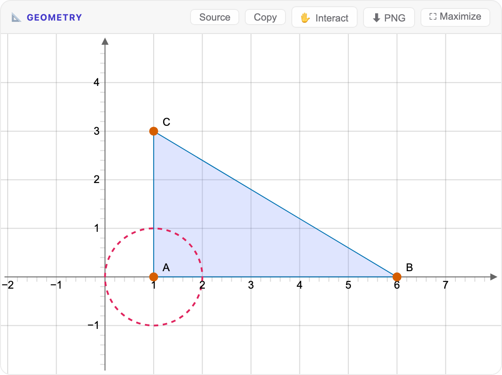
</p>
<p align="center">
  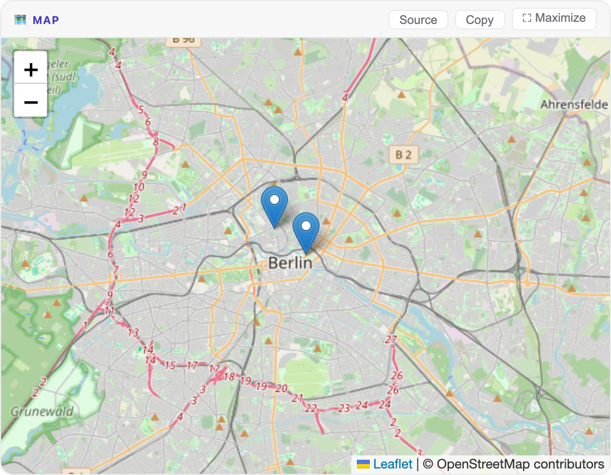
  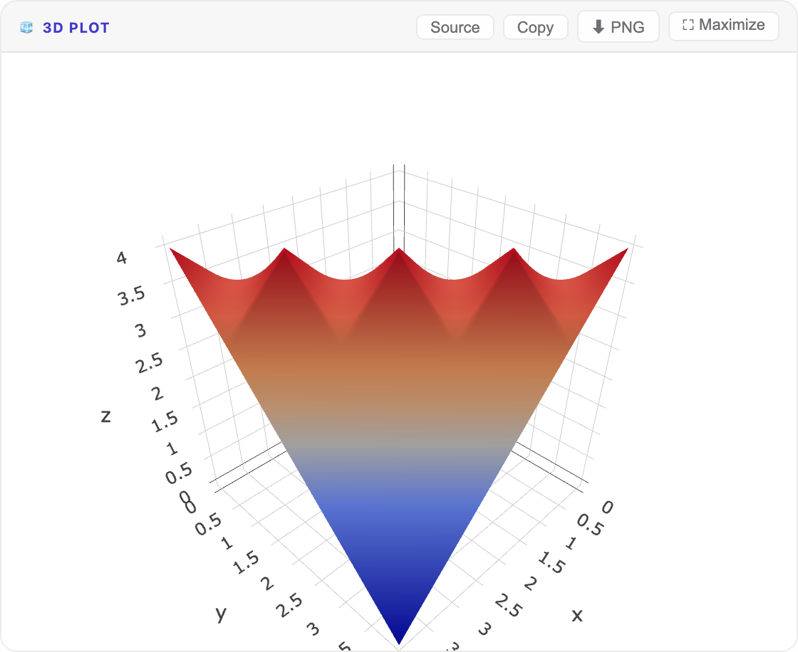
  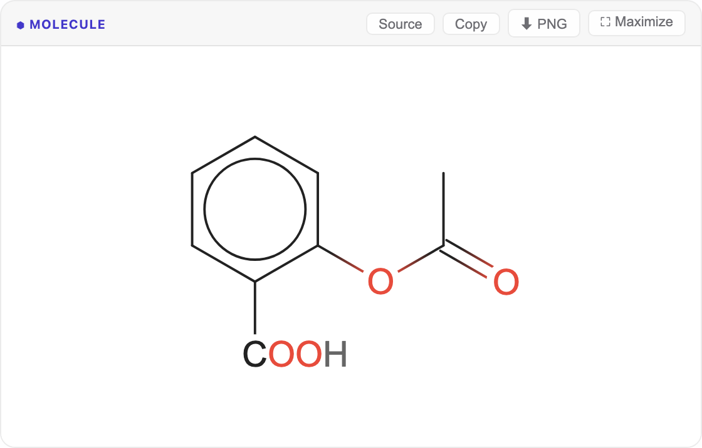
</p>
<p align="center">
  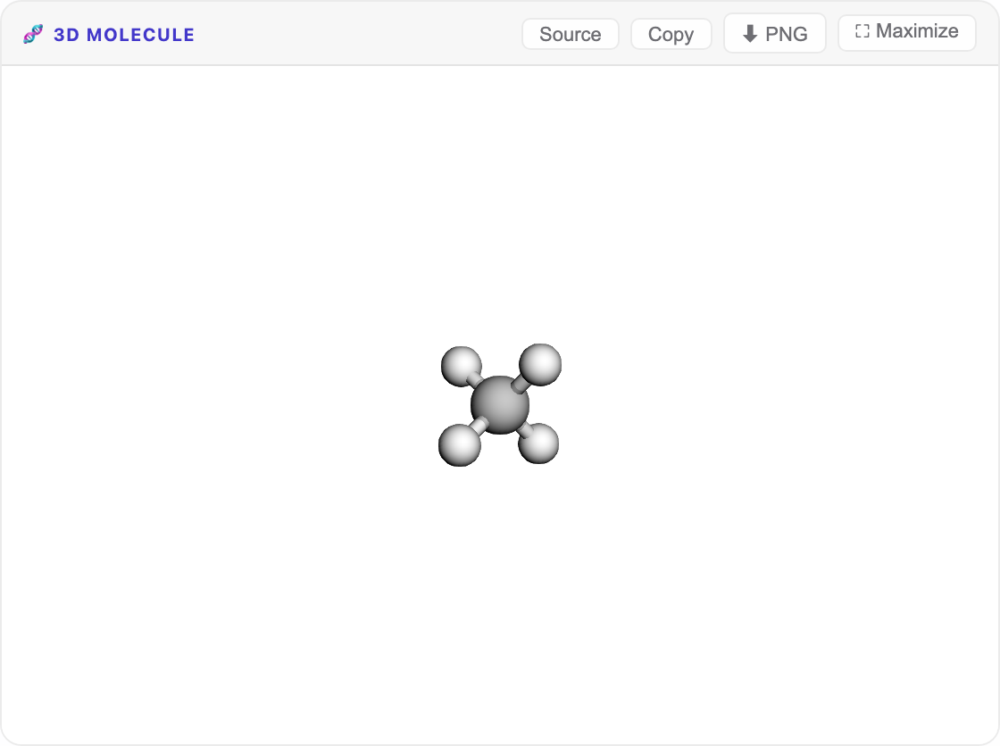
  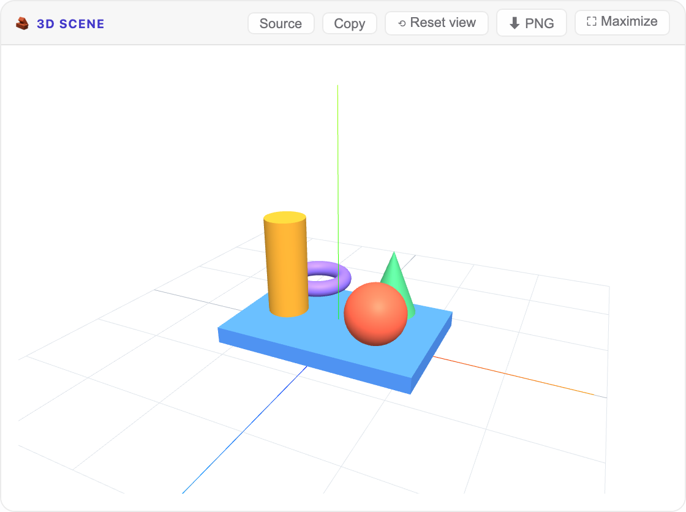
  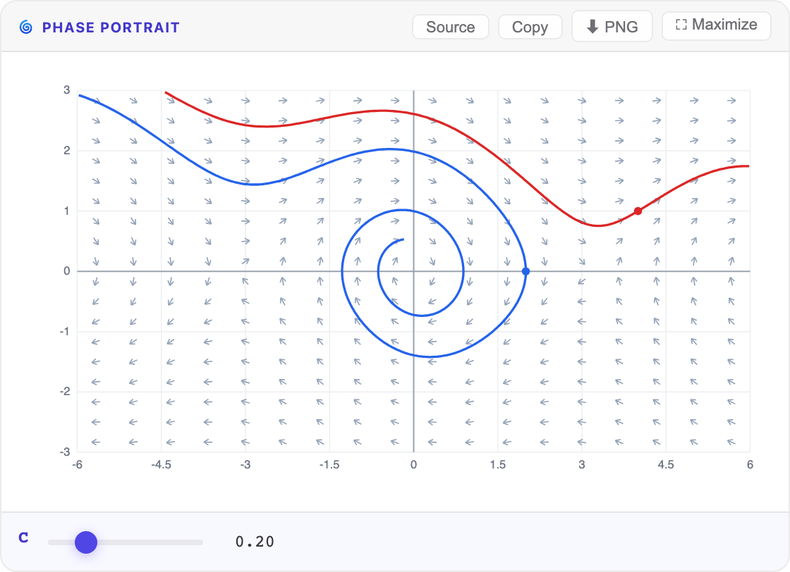
</p>

Every rendered figure gets a **Source** toggle, **Copy** button, and an **⛶ Maximize** button that opens it full-viewport; most also have a **⬇ PNG** export. The source is editable in place: **▶ Apply** re-renders the figure from your changes and **↺ Reset** restores the original.

<p align="center">
  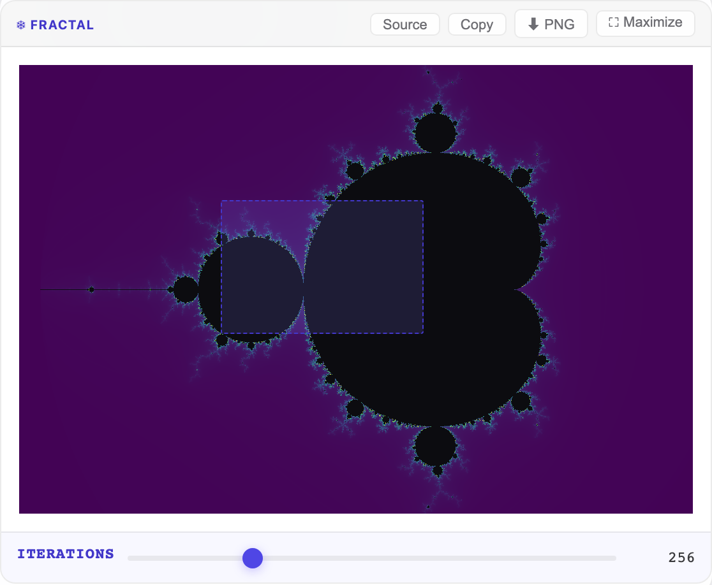
  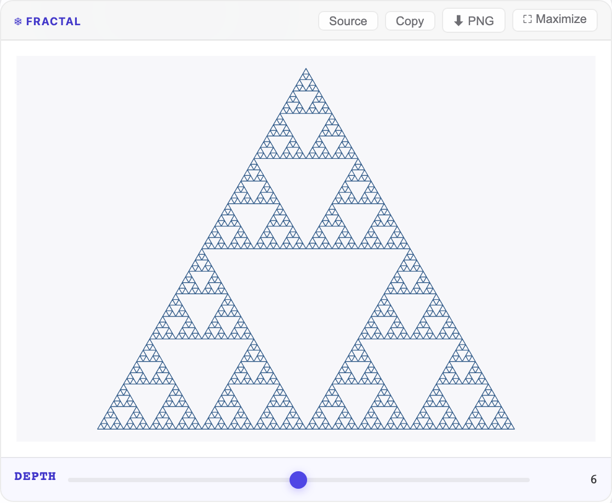
  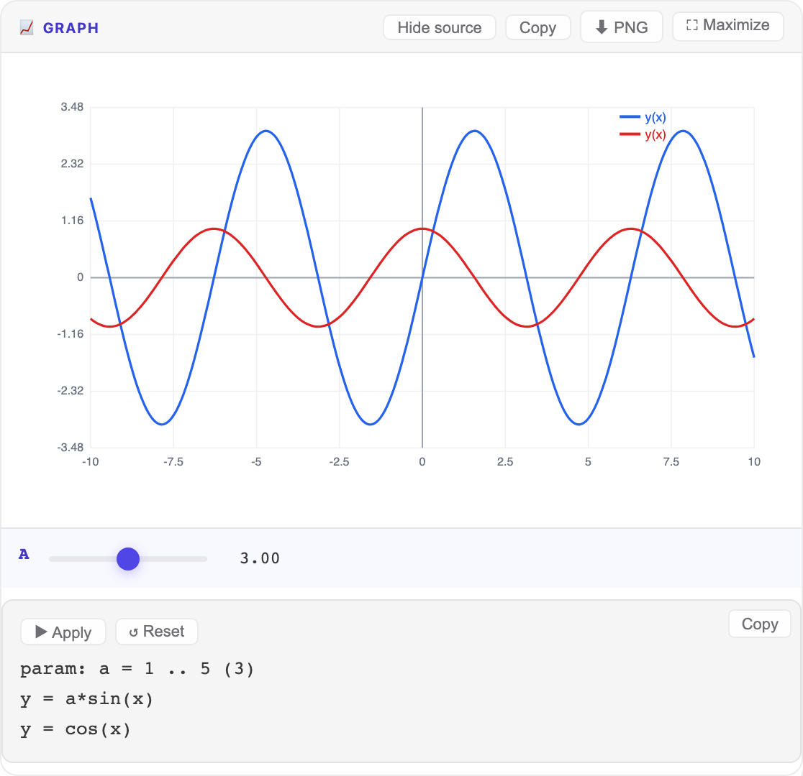
</p>

Fractals are interactive: drag a box on a Mandelbrot or Julia card to zoom in, and every fractal has a slider — **Iterations**, **Depth** or **Steps** — that re-renders it in place.

The heavier renderers (Mermaid, Chart.js, Plotly, Leaflet, JSXGraph, Viz.js, SmilesDrawer, 3Dmol.js, three.js, highlight.js) are **lazy-loaded on first use**, so they cost nothing at page load. All renderer libraries come from a public CDN; ` ```map ` additionally requests OpenStreetMap tiles for the coordinates shown. See [DOCS.md](DOCS.md#rich-content-rendering) for the full reference.

### Prompts to try

Type any of these into the chat with **No RAG** selected (no documents needed). Each one is a single sentence; the answer comes back as a live figure you can zoom, rotate, drag or edit.

| Ask | What you get |
|---|---|
| *Show me the Mandelbrot set.* | The full set on a canvas — drag a box anywhere on the edge to zoom in, again and again, and push the **Iterations** slider up as you go deeper |
| *Show the Julia set for c = −0.8 + 0.156i.* | A swirling Julia set with the same box-zoom and slider |
| *Draw the Lorenz attractor.* | The butterfly, traced as an orbit; the **Steps** slider integrates it further |
| *Draw a Barnsley fern.* | The fern as a dense point cloud, filling in as you raise **Iterations** |
| *Draw a Koch snowflake and a Sierpinski triangle.* | Two cards; step each one's **Depth** slider from 1 upward and watch the structure build |
| *Build a 3D scene of a red box on a blue plate with a golden sphere on top and a purple torus beside it.* | A rotatable 3-D scene — drag to orbit, wheel to zoom, shift-drag to pan, **⟲ Reset view** to go back |
| *Plot the 3D surface z = sin(x)·cos(y).* | A shaded surface you can spin |
| *Plot y = sin(a·x)/x with a slider for a from 1 to 10.* | A graph with a live slider; drag it and the curve re-draws instantly |
| *Graph the rose curve r = cos(4θ).* | An eight-petal polar rose |
| *Show the vector field of a vortex, −y, x.* | A whirl of arrows across the plane |
| *Plot the contours of x² − y² and the implicit curve x² + y² = 4.* | Saddle contours in a blue ramp with the circle drawn in red on top |
| *Plot the phase portrait of a damped pendulum with a slider for the damping.* | Direction field, spiralling trajectories, and a damping slider that re-integrates them as you drag |
| *Draw the structure of caffeine.* | The molecule as a chemical structure |
| *Show the esterification of acetic acid and ethanol as a reaction scheme.* | Reactants, arrow and products drawn as structures |
| *Draw the schematic of an LED circuit: a 9 V battery, a 220 Ω resistor and an LED.* | A schematic with the symbols on a grid |
| *Show the phylogenetic tree of the great apes with branch lengths.* | A phylogram with a scale bar |
| *Align the first 60 residues of human and mouse hemoglobin alpha.* | A coloured alignment with every differing column marked |
| *Make a sunburst chart of a typical monthly household budget.* | A drillable ring chart |
| *Draw a mind map of the solar system.* | A radial mind map, planets branching from the Sun |
| *Put the seven wonders of the ancient world on a map.* | A world map with a marker and popup for each |
| *Draw a timeline of the Apollo missions.* | A dated timeline card |
| *Write sheet music for the first line of "Twinkle, Twinkle, Little Star".* | A rendered score with a **▶ Play** button |
| *Show a geometric construction of the golden ratio.* | An interactive construction — press **✋ Interact** and drag its points |

Every card has a **Source** button: change a number in the block, press **▶ Apply**, and the figure re-renders in place. If an answer comes back as plain text, ask the model to *"render that as a ```fractal block"* (or whichever fence fits) — the fence names are listed in the table above.

---

## Grounded answers you can check

Answers cite the passages they came from, so any claim can be traced back to the chunk that supports it. Click **⌖ only this** on a chunk to scope your next question to that document alone.

<p align="center">
  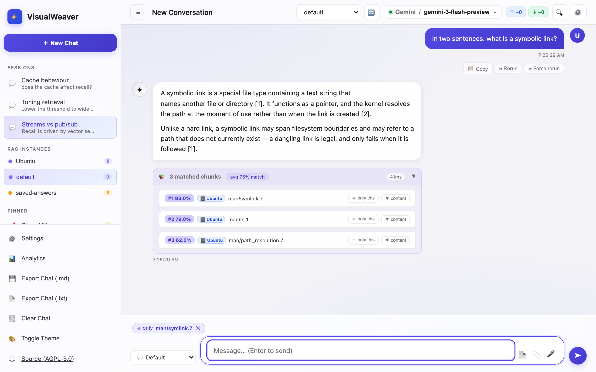
</p>

When retrieval finds nothing above the threshold, the answer says so and is badged **📭 No KB match** — rather than quietly answering from general knowledge as though it were grounded.

<p align="center">
  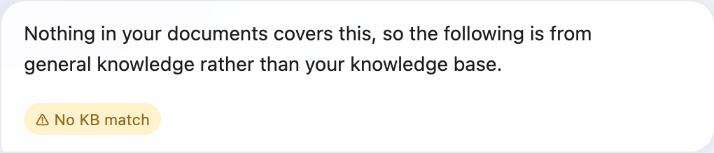
</p>

Each knowledge base is browsable: see what's indexed, scope a question to one document, or remove a single stale document and re-ingest it without rebuilding everything.

<p align="center">
  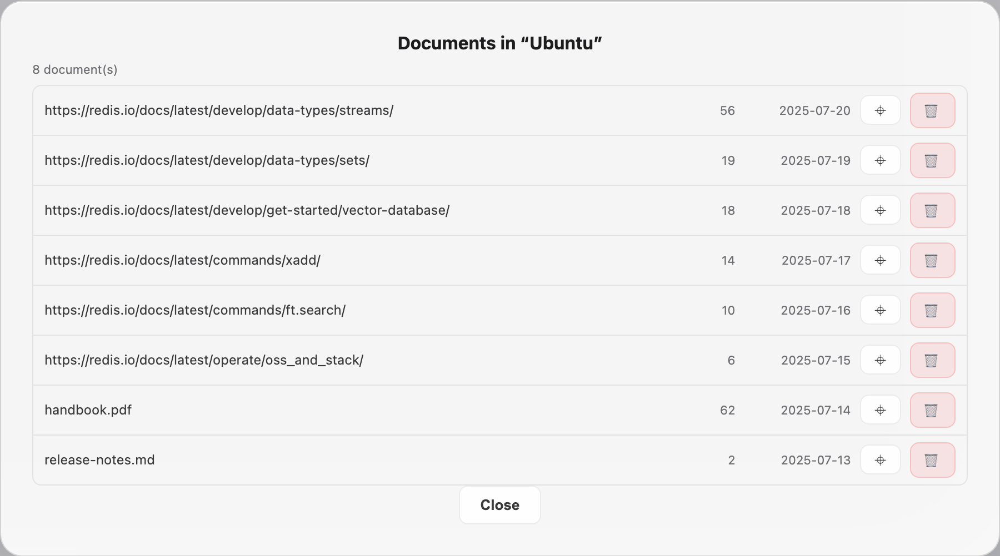
</p>

---

## Quick start

### Docker (simplest)

VisualWeaver runs as two containers: the **app** (a prebuilt multi-arch image — `linux/amd64` + `linux/arm64` — published to GitHub's Container Registry) and **Redis 8** with the query engine (from Docker Hub). Both are defined in [`docker-compose.yml`](docker-compose.yml).

**Requires** Docker Engine with the Compose v2 plugin — verify with `docker compose version`.

**1. Pull the images** (app from GitHub, Redis from Docker Hub):

```bash
docker compose pull
```

*(or pull them individually: `docker pull ghcr.io/sfcyris/visualweaver:latest` and `docker pull redis:8`.)*

**2. Start:**

```bash
docker compose up -d
```

Then open **http://localhost:8420** and add an LLM provider in **Settings → Providers**.

**3. Stop:**

```bash
docker compose stop     # stop the containers, keep them and your data
docker compose down     # stop and remove the containers (the data volume persists)
```

Your state lives in **two** named Docker volumes, both of which survive restarts and re-pulls: **`visualweaver-data`** (config, uploads, logs, ingestion history) and **`visualweaver-redis`** (the ingested, embedded knowledge base and its vector index — the AOF/RDB persistence). To upgrade, `docker compose pull && docker compose up -d`. **A full backup must capture both volumes** — saving only `visualweaver-data` loses the entire index, forcing a full re-ingest.

> **Building from source instead:** comment the `image:` line and uncomment `build:` in `docker-compose.yml`, then `docker compose up -d --build`.

#### CPU embeddings, and optional GPU

The image ships a **CPU-only build of PyTorch**. That is deliberate: the default PyPI `torch` drags in NVIDIA's CUDA runtime wheels, which are proprietary and must not be redistributed inside an AGPL image (see [THIRD-PARTY-LICENSES.md](THIRD-PARTY-LICENSES.md)). It also keeps the image roughly 2 GB smaller. Embedding a document corpus on CPU is perfectly usable — the LLM itself runs elsewhere (Ollama or a cloud provider).

If you have an NVIDIA GPU and want accelerated embeddings, install the CUDA build **yourself, on your own machine** — pick the channel matching your driver (`cu126`, `cu128`, `cu129`, `cu130`):

```bash
docker compose exec visualweaver pip install --force-reinstall torch --index-url https://download.pytorch.org/whl/cu129
```

Add `--gpus all` (or a `deploy.resources` reservation in compose) so the container can see the GPU, and re-run it after any `docker compose pull`, since a fresh image is CPU-only again. For a permanent GPU image, change that one `pip install` line in the `Dockerfile` and build it yourself — the resulting image is then yours to distribute or not.

### Local (macOS / Linux)

```bash
./install.sh     # Python venv + a self-contained Redis 8 in ./.redis
./start.sh       # starts Redis, then the app
```

Open **http://localhost:8420**. Stop everything (app + its Redis) with `./stop.sh`; `./restart.sh` restarts.

`install.sh` vendors a private Redis 8 into `./.redis` and runs it on a dedicated loopback port (6389 by default), so it never touches or conflicts with any Redis you already run. On Linux, if you already have a Redis with the search module it is reused instead.

**Requirements:** Python 3.11+, and on macOS Homebrew (for `openssl@3`) + Xcode Command Line Tools.

---

## Configuration

Settings are stored **outside the repo**, in a per-platform data directory:

| Platform | Location |
|---|---|
| macOS | `~/Library/Application Support/VisualWeaver` |
| Linux | `$XDG_DATA_HOME/visualweaver` or `~/.local/share/visualweaver` |

That directory holds `config.json`, uploads, logs, and ingestion history. A clean template is in [`config.example.json`](config.example.json). Configure everything from the in-app **Settings** UI, or set provider keys via environment variables so they are never written to disk:

```bash
export ANTHROPIC_API_KEY=...   # Claude
export OPENAI_API_KEY=...       # OpenAI
export GEMINI_API_KEY=...       # Gemini
export GROQ_API_KEY=...         # Groq
export DASHSCOPE_API_KEY=...    # Qwen
export MISTRAL_API_KEY=...      # Mistral
```

**Ports:** the web UI is **8420**; the dedicated Redis is **6389** (loopback only). Override the app port with `VISUALWEAVER_PORT`, or `./start.sh 9000`.

---

## Features

**💬 Chat** — token-by-token streaming over WebSocket; [rich inline rendering](#what-answers-can-render) (diagrams, charts, graphs, maps, molecules, music, math); image attachments for vision models (drag/drop, paste); voice input; regenerate in place with a version switcher to compare attempts; **Copy, Rerun, or Force rerun** (cache-bypassing) any earlier question from its hover action bar; conversations persisted in Redis and restored on reload; **keep an answer** — index one into a knowledge base so it outlives the cache and the conversation, after editing it and its cited sources; **search across conversations** (Shift+⌘/Ctrl+F), including the retrieved source passages, with match counts — plain ⌘/Ctrl+F is left to the browser; pin messages; rate answers (👍/👎); auto-generated session titles; a top-bar token count split into input/output/total, using the provider's own billed figures; export as text.

**🧠 RAG** — multiple named knowledge bases (RAG instances); ingest PDF, DOCX, XLSX, TXT, CSV, and Markdown files; a parallel BFS web crawler with a smart httpx-first mode and optional JS rendering (crawl4ai + Playwright) for SPAs — pausable, cancellable, and reporting real progress against the pages it has discovered; **scheduled auto re-crawl** of web sources, managed from Settings; file ingestion that can be watched, re-attached to and stopped; `llms.txt` auto-detection; **hybrid retrieval** — vector KNN + BM25 keyword search fused by RRF (on by default), with optional cross-encoder reranking and HyDE; a RAG inspector showing retrieved chunks and scores; **inline citations** linking each claim to the passage that supports it — click a `[2]` marker to open and highlight the source it refers to; **per-document management** — browse what's indexed, scope a question to one document, or delete one without rebuilding the instance; an explicit *No KB match* badge when retrieval finds nothing; a top-bar selector to query one instance, **all** of them in parallel, or **No RAG** (answer with no retrieval); export/import a knowledge base as a zip; duplicate detection.

**⚡ Semantic cache** — cosine-similarity response caching in Redis with a configurable threshold and TTL; per-message hit/miss badge; delete or re-run cached answers.

**🤖 LLM providers** — Ollama (local, no key), Claude, OpenAI, Qwen, Mistral, Groq, Gemini. Switch providers and models from the UI; vision auto-detected for capable models.

**⚙️ Settings** — Redis connection (incl. multiple endpoints), embedding-model selector, chunk-size/overlap/top-K/threshold controls, a **chat-history token budget**, a **chart-authoring toggle** (drop ~2k tokens/message on text-only deployments), reusable prompt templates, dark/light/auto theme, export/import config; staged edits are marked **unsaved** and confirmed before they are discarded.

**📊 Observability** — per-response latency breakdown (cache / RAG / LLM / total), Redis memory monitor, cache analytics, ingestion logs, a session notification log (errors stay until dismissed), a system-status panel covering every provider, and an all-time **token usage** table broken down by provider and model (CSV export included) — token counts only, so no stale price estimate is passed off as your bill.

<p align="center">
  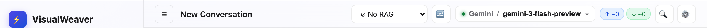
</p>
<p align="center">
  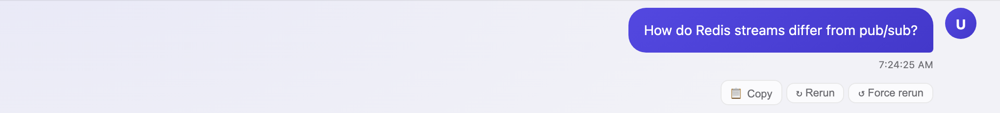
</p>
<p align="center"><sub>Query one knowledge base, all of them in parallel, or <b>No RAG</b> per message &nbsp;&bull;&nbsp; <b>Copy</b>, <b>Rerun</b>, or <b>Force rerun</b> any earlier question from its hover bar.</sub></p>

---

## Security

VisualWeaver has **no built-in authentication**. The **local runtime** (`start.sh`) binds to `127.0.0.1` (localhost only) by default. The **Docker Compose** setup, however, publishes port 8420 on all host interfaces (`0.0.0.0`), so it *is* reachable from your network — run it only on a trusted network, bind it to localhost by changing the mapping to `127.0.0.1:8420:8420` in [`docker-compose.yml`](docker-compose.yml), or put a reverse proxy with authentication in front of it (see [`deploy/docker-compose.https.yml`](deploy/docker-compose.https.yml) for a Caddy + automatic-HTTPS setup). **Never expose the port on an untrusted network without an auth layer.**

**Untrusted content.** Model and RAG output is treated as untrusted: rendered Markdown and every SVG/diagram is sanitised (DOMPurify) before it reaches the DOM, the `geometry` block accepts data only — never expressions — and a Content-Security-Policy restricts scripts to the app itself plus the two CDNs the renderers come from. Ingested pages can carry prompt injections, so this matters in normal use, not just under attack.

One deliberate trade-off: `img-src` permits any `https:` source, because answers legitimately show images from the pages and documents you ingest, plus map tiles. In principle that is an exfiltration channel if script execution were ever achieved. `connect-src` is far narrower — `'self'` plus one fixed host, `https://paulrosen.github.io`, which abcjs fetches General-MIDI soundfont samples from for the `abc` Play button — so `img-src` remains the broad channel and `connect-src` is limited to that single static-asset host. If your deployment does not need remote images, tighten `img-src` in `_CSP` (`visualweaver/appcore.py`) to `'self' data: blob:`; if you do not need `abc` audio playback, drop `https://paulrosen.github.io` from `connect-src` to bring it back to `'self'`.

---

## Documentation

- **[TUTORIAL.md](TUTORIAL.md)** — step-by-step getting started
- **[DOCS.md](DOCS.md)** — full feature and API reference
- **[SETTINGS.md](SETTINGS.md)** — every setting explained

---

## Acknowledgments

VisualWeaver is built on excellent open-source projects:

- **[Redis](https://redis.io)** — in-memory datastore and vector/query engine *(AGPLv3)*
- **Backend** — [FastAPI](https://fastapi.tiangolo.com) & [Uvicorn](https://www.uvicorn.org) *(MIT / BSD-3-Clause)*, [redis-py](https://github.com/redis/redis-py) and [RedisVL](https://github.com/redis/redis-vl-python) *(MIT)*, [NumPy](https://numpy.org) *(BSD-3-Clause)*, [sentence-transformers](https://www.sbert.net) *(Apache-2.0)*, [PyMuPDF](https://pymupdf.readthedocs.io) *(AGPLv3)*, [Trafilatura](https://trafilatura.readthedocs.io) *(Apache-2.0)*, [Beautiful Soup](https://www.crummy.com/software/BeautifulSoup/) *(MIT)*, [Pillow](https://python-pillow.org) *(MIT-CMU)*, [httpx](https://www.python-httpx.org) *(BSD-3-Clause)*, and [Crawl4AI](https://github.com/unclecode/crawl4ai) + [Playwright](https://playwright.dev) *(Apache-2.0)*
- **Document parsing** — [python-docx](https://python-docx.readthedocs.io) and [openpyxl](https://openpyxl.readthedocs.io) *(MIT)*
- **LLM providers** — [Ollama](https://ollama.com) for local models, and the [Anthropic](https://github.com/anthropics/anthropic-sdk-python) *(MIT)*, [OpenAI](https://github.com/openai/openai-python), [Groq](https://github.com/groq/groq-python), and [Google GenAI](https://github.com/googleapis/python-genai) *(Apache-2.0)* SDKs
- **Deployment** — [Caddy](https://caddyserver.com) *(Apache-2.0)* for automatic HTTPS

**Browser rendering** — the libraries that turn an answer into a figure. Each is fetched from a public CDN ([cdnjs](https://cdnjs.com), or [jsDelivr](https://www.jsdelivr.com) for smiles-drawer and viz.js) the first time its block type appears:

| Library | Used for | License |
|---|---|---|
| [marked](https://marked.js.org) | Markdown | MIT |
| [DOMPurify](https://github.com/cure53/DOMPurify) | sanitising SVG & rendered HTML | Apache-2.0 / MPL-2.0 |
| [KaTeX](https://katex.org) | LaTeX math | MIT |
| [math.js](https://mathjs.org) | evaluating ` ```plot ` functions | Apache-2.0 |
| [Chart.js](https://www.chartjs.org) | ` ```chart ` data charts | MIT |
| [Mermaid](https://mermaid.js.org) | ` ```mermaid ` diagrams | MIT |
| [Viz.js](https://github.com/mdaines/viz.js) | ` ```dot ` graph layout — a build of [Graphviz](https://graphviz.org) 15.1.1 *(EPL-2.0)* | MIT |
| [JSXGraph](https://jsxgraph.org) | ` ```geometry ` constructions | MIT or LGPL-3.0-or-later |
| [Leaflet](https://leafletjs.com) | ` ```map ` maps | BSD-2-Clause |
| [Plotly.js](https://plotly.com/javascript/) | ` ```plot3d ` 3-D plots and ` ```plotly ` statistical charts | MIT |
| [SmilesDrawer](https://github.com/reymond-group/smilesDrawer) | ` ```molecule ` structures and ` ```reaction ` schemes | MIT |
| [3Dmol.js](https://3dmol.csb.pitt.edu) | ` ```molecule3d ` rotatable 3-D structures | BSD-3-Clause |
| [three.js](https://threejs.org) | ` ```scene ` 3-D scenes | MIT |
| [abcjs](https://www.abcjs.net) | ` ```abc ` sheet music | MIT |
| [highlight.js](https://highlightjs.org) | code syntax highlighting | BSD-3-Clause |

Map tiles are served by [OpenStreetMap](https://www.openstreetmap.org/copyright) — map data © OpenStreetMap contributors, available under the [Open Database License](https://opendatacommons.org/licenses/odbl/) (attribution is shown on every rendered map).

Each dependency is distributed under its own license; the full text ships with each package. A complete inventory of every dependency and its license — including the multi-licensed ones and which option VisualWeaver elects — is in **[THIRD-PARTY-LICENSES.md](THIRD-PARTY-LICENSES.md)**.

---

## Trademarks

**Redis** is a registered trademark of Redis Ltd. VisualWeaver is an independent project that
integrates with Redis® OSS. It is **not endorsed, supported, sponsored, or certified by
Redis Ltd.**, and no affiliation is implied. The Redis logo and visual identity are not
used anywhere in this project; Redis is referred to by name only, to identify the software
VisualWeaver connects to.

Docker, GitHub, Google Gemini, Anthropic Claude, OpenAI, Mistral, Ollama, Groq and Qwen —
and every other product named in this documentation or in the application — are trademarks
of their respective owners. They are used for identification only. None of those owners
endorses, sponsors or is affiliated with VisualWeaver.

A trademark is separate from the licence its software ships under: an open-source licence
grants rights in the code, not in the name or the logo.

## License

VisualWeaver is licensed under the **[AGPL-3.0-or-later](LICENSE)**.

This matches what the dependency stack requires: **PyMuPDF** (PDF extraction) and **Redis 8** are themselves AGPLv3, and the other Python dependencies are permissive (MIT / BSD / MIT-CMU) or Apache-2.0 — all one-way compatible into AGPLv3, so the combined work is cleanly licensable under the AGPL. Using VisualWeaver under different terms would mean replacing the AGPL components (for example, obtaining a commercial PyMuPDF license from Artifex).

The browser rendering libraries are **not bundled or redistributed** — VisualWeaver ships only a URL, and the browser fetches each one from a public CDN at runtime. They are MIT / BSD / Apache-2.0 / MPL-2.0 (JSXGraph is dual MIT-or-LGPL, used here under MIT). One note for completeness: `viz.js` is MIT but embeds **Graphviz** 15.1.1, which is under the Eclipse Public License 2.0 — a license the FSF considers GPL-incompatible. Because it is loaded at runtime by the browser rather than distributed with VisualWeaver, it does not form a combined work with this AGPL codebase; anyone who chooses to *vendor* these libraries into a distributed build should review that themselves.
